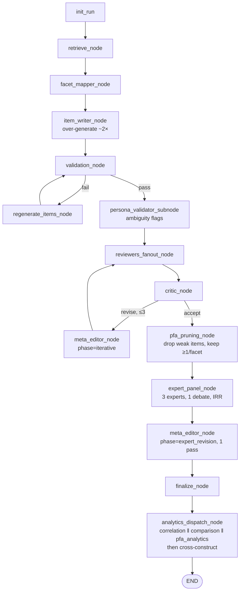

# Implementation Plan: PFA + Expert Panel + Persona Validation

**Status:** Draft for /ultraplan refinement
**Author:** Claude (Opus 4.7) — synthesis from 4 PDFs + 3 PFA notebooks + current codebase
**Date:** 2026-04-29
**Targets:** Vercel-deployable, OpenAI embedding–based, no PyTorch / no R / no local sentence-transformers

---

## 1. Executive Summary

We add three capabilities to the MAPIG pipeline, each grounded in a peer-reviewed paper:

1. **Pseudo-Factor Analysis (PFA) Analytics Agent** — embedding-based proxy for empirical EFA, run after finalization. Produces factor recovery rate, Tucker's congruence, model-free fit indices, and item retention recommendations *before* a single human respondent has been recruited. Source: **5000.pdf** (Varrasi et al., 2026, *Methods in Psychology*) + supporting practical guide in **4896.pdf** (Suárez-Álvarez et al., 2026, *Psicothema*).

2. **Expert Panel (Multi-Agent Face/Content Validity)** — runs *after* the existing reviewer fan-out (linguistic + bias + content) and after the critic accepts. Three+ persona-grounded "expert" agents (psychometric expert, domain expert, localization expert) independently rate items, debate, compute inter-rater reliability (IRR), and hand a single consensus revision plan back to the meta-editor for one final refinement before `finalize_node`. Inspired by **6000.pdf** (PySIG, ICASSP 2026) but adapted to expert-rater simulation rather than respondent simulation.

3. **Persona-Based Conceptual Alignment** (lightweight) — adapted from **4897.pdf** (Keane & McNaughton, *International Journal of Market Research*, Step 13). The expert panel's localization expert subsumes the original persona role; we additionally run 2 lightweight respondent-personas at the validator stage to surface ambiguity early. Low-complexity addition.

All three changes preserve existing item-development rules (atomic commits per phase, validation tiers, critic adaptive thresholds, bias construct-level filter, evidence depth, anti-stagnation, sanitizer, etc.).

---

## 2. What Each PDF Adds — and What We Already Have

### 2.1 — 5000.pdf · Pseudo-Factor Analysis (PFA), Varrasi et al., 2026

**Method**: Cosine similarity matrix of item embeddings → treat as correlation matrix → run EFA with target (or oblique) rotation → compare with reference factor structure using Tucker's congruence and factor recovery rate.

**Key parameters**:
- Tucker's congruence: >0.85 fair, >0.95 excellent
- Factor recovery rate: % of factors successfully replicated
- Best English-language models (paper): T5, DistilRoberta, MiniLM, MPNet (EN)
- Best multilingual: MPNet, MiniLM
- Reverse-coded items: flip sign of embedding (or store separately)
- Diagonal of similarity matrix set to 1.0 (so EFA treats it as correlation)
- DAAL (Dominant Average Absolute Loading): label factors by group with highest avg absolute loading

**Already in codebase**: We have OpenAI embedding–based cosine similarity in `correlation_estimator.py` (text-embedding-3-small) and `similarity_calculator.py`. We do **not** run EFA on it. We do not compute Tucker's congruence or factor recovery.

**NEW deliverables**:
- EFA on cosine similarity matrix using `factor-analyzer` (pure Python, Vercel-safe)
- Tucker's congruence calculator (pure NumPy)
- Factor recovery rate metric (scoring whether each expected factor's items load most strongly together)
- DAAL factor labelling
- Iterative item refinement loop (drop weak/cross-loading items, recompute)
- Model-free fit indices (RMSR, CAF, residual-correlation heatmap data)

### 2.2 — 4896.pdf · Practical Guide, Suárez-Álvarez et al., 2026 (Psicothema)

**10 best practices** spanning test development (steps 1–5) and item calibration (steps 6–10).

**Already in codebase**:
- (Step 1) Quality training data — sanitizer + retrieval agent
- (Step 3) Compare multiple AI models — partial (we use Sonnet/Opus/GPT-4o-mini per agent)
- (Step 6) Sentence encoders for semantic construct validity — yes, in correlation_estimator
- (Step 7) Prompt engineering — yes, all our `.md` prompts
- (Step 8) Semantic item alignment — yes, in correlation_estimator
- (Step 9) Embedding-based factor analysis — *partially* (we have similarity, not factor analysis) → covered by §2.1
- (Step 10) Model-free exploratory fit — *not yet*; covered by §2.1

**NEW deliverables** (beyond §2.1):
- **Item retention criteria** (4 rules from paper): item loads highest on parent factor; higher than on any other factor; higher than its average across other factors; higher than the average of all other items on that factor. → Drives PFA-based item dropping in iterative refinement.
- **Inter-rater agreement framing** (step 4): Treat AI as a "rater" and compute IRR with humans/other AI. → Used in expert panel design (§4).
- **Generate ~2× target item count, then prune via PFA** (step 9). → Add `target_overgenerate_factor=2.0` setting and prune by PFA loadings.

### 2.3 — 4897.pdf · Keane & McNaughton, 2026 (Step 13: Persona-Based Validation)

**Step 13 description**: "The AI model assumed the persona of a target respondent to rate the items, providing justifications for responses. This process was repeated with multiple personas to ensure conceptual alignment."

**Already in codebase**: None of this exists today. Our reviewers are role-agnostic critics, not respondent personas.

**NEW deliverable**:
- Lightweight persona validator: 2–3 GPT-4o-mini calls, each one assumes a respondent persona derived from `target_population` + `cultural_group` (e.g., "32-year-old township nurse in Cape Town"), rates each item on a Likert scale, gives a one-sentence justification. Output: per-item "interpretive variance" score and any items where personas disagree dramatically.
- This is **not** the expert panel — it's a separate cheaper check that runs at the validator stage. Surfaces inclusivity / clarity issues that current bias reviewer misses (e.g., culturally specific idioms a 60-year-old wouldn't read the same way as a 22-year-old).

### 2.4 — 6000.pdf · PySIG, Han et al., ICASSP 2026

**Method**: LLMs as virtual respondents (10× item count) to compute Cronbach's α, KMO, and Bartlett's test. Multidimensional eval framework spans Specialization, Adaptability, Diversity (Self-BLEU), Reliability, Validity. Note: this is **not** a multi-agent expert review paper.

**Already in codebase**: Some overlap — Cronbach's α via McDonald's omega, KMO is missing.

**NEW for this plan (light borrow only)**:
- Add **simulated reliability check** as part of PFA analytics: have GPT-4o-mini answer each item under each of N personas (N=10× item count) → compute Cronbach's α and KMO from simulated responses. Treat as a *secondary* signal (not primary), since PFA on embeddings is the primary structure check.
- We do **not** adopt PySIG wholesale — its target use case (group-customized scale generation) overlaps with our existing facet_mapper + item_writer combo.

### 2.5 — User-specified Expert Panel (no single paper; synthesized)

**Position**: After reviewers + critic accepts → before finalize.

**Roles**: Psychometric expert, Domain expert, Localization/cultural expert. Extensible config so users can add roles.

**Process**:
1. Each expert agent independently scores items on its own rubric (psychometric: face validity, parsimony, redundancy; domain: construct fidelity, theoretical alignment; localization: cultural fit, language clarity for `target_population`).
2. Round 1: independent scores written to state.
3. Round 2 ("debate"): each expert sees the others' scores and may revise its own with a justification — capped at 1 round to bound cost.
4. Compute IRR (Krippendorff's α for ordinal, reported alongside agreement matrix).
5. Aggregate into a single `ExpertConsensus` containing rated items, dissent flags, and a prioritized list of revision suggestions for the meta-editor.
6. Meta-editor runs ONE final pass using these suggestions (we reuse the existing meta-editor with a new `phase=expert_revision` flag — no new agent class needed).
7. Then proceed to `finalize_node`.

**Why not just add another reviewer to the fan-out?** Because the expert panel is *evaluative of the final set*, not corrective during the iteration loop. Adding it to the fan-out would re-trigger the critic→meta-editor cycle and increase iterations beyond the 3-iteration cap. Putting it after critic accept is the right semantic position: "the items are clean — now let's do face/content validity."

---

## 3. Vercel & Dependency Strategy

### 3.1 Constraints

- 250 MB unzipped Lambda — **no PyTorch, no torch, no sentence-transformers, no transformers**.
- 10-minute max execution per request.
- Cold starts; in-memory checkpointing only.

### 3.2 Embedding Choice

**Primary**: OpenAI `text-embedding-3-large` (3072 dims) for PFA. We currently use `text-embedding-3-small` (1536 dims) for correlation. Recommend upgrading PFA-only to `-large` because PFA is more sensitive to embedding quality (paper: T5/DistilRoberta give best congruence; OpenAI 3-large has higher MTEB scores than both). Keep `-small` for live correlation_estimator (cost).

**Validation**: Run a calibration eval comparing `text-embedding-3-small` vs `text-embedding-3-large` PFA outputs against the paper's published DASS-21 / DTDD factor structures. Pick the model with mean Tucker's congruence ≥0.85 across both scales.

**Rationale for not using sentence-transformers locally**: Paper's best models (DistilRoberta, T5) are sentence-transformers, but the package + PyTorch is ~2 GB → cannot fit on Vercel. The `similarity_calculator.py` already documents this constraint and migrated to OpenAI. We follow the same pattern.

### 3.3 Factor Analysis Library

**`factor-analyzer`** (PyPI) — pure Python, depends on numpy + scipy + pandas. Already meets Vercel constraints. Used in the supplied notebooks as the install target alongside `sentence_transformers`.

Capabilities relevant to us:
- `FactorAnalyzer(n_factors=k, rotation='oblimin')` — oblique rotation (preferred for psychological constructs).
- `.loadings_` — pattern matrix.
- `.get_eigenvalues()`, `.get_communalities()`, `.get_uniquenesses()`.
- `.fit(matrix, is_corr_matrix=True)` — accepts a precomputed correlation matrix (which is what cosine similarity becomes).

**Limitation**: No native target rotation. Workaround: use `oblimin` and compare to expected pattern matrix via Tucker's congruence (our metric anyway).

### 3.4 Inter-Rater Reliability

Implement **Krippendorff's α** in pure NumPy (~30 LOC). Optionally add Cohen's κ for pairwise agreement matrices. No new dependency.

### 3.5 Updated `pyproject.toml`

```toml
dependencies = [
    # existing...
    "factor-analyzer>=0.5.1",  # pure-Python EFA, ~150 KB wheel
    "scipy>=1.11.0",            # likely already pulled in transitively
]
```

---

## 4. Architecture Changes

### 4.1 New Pipeline Flow (final)

```
init_run
  → retrieve_node
  → facet_mapper_node
  → item_writer_node                       [over-generate ~2× target]
  → validation_node
      ├─ persona_validator_subnode (NEW)   [2-3 personas, ambiguity flagging]
      └─ regenerate loop (≤3)
  → reviewers_fanout_node                  [linguistic + bias + content]
  → critic_node                            [strict / thorough / final]
  → [meta_editor → reviewers → critic loop, ≤3]
  → expert_panel_node (NEW)                [3+ experts, 2 rounds, IRR]
  → meta_editor_node                       [phase=expert_revision, ONE pass]
  → pfa_pruning_node (NEW)                 [iterative item drop via PFA]
  → finalize_node
  → analytics_dispatch_node                [correlation || comparison || PFA (NEW) || cross-construct]
```

PFA runs in two places:
- **`pfa_pruning_node`** before finalize — prunes the over-generated set down to `item_count` using item retention criteria.
- **PFA analytics** in `analytics_dispatch_node` — reports the *final* factor structure, congruence, DAAL labels, fit indices for the UI.

### 4.2 New Agents / Files

| File | Purpose |
|------|---------|
| `backend/agents/persona_validator.py` | Step-13 persona alignment (lightweight) |
| `backend/agents/expert_panel.py` | Multi-expert evaluation + debate + IRR |
| `backend/agents/pfa_estimator.py` | Cosine matrix → EFA → loadings + congruence + fit |
| `backend/analytics/pfa_analytics.py` | Post-final PFA for the UI |
| `backend/analytics/krippendorff.py` | Pure-Python IRR helpers |
| `backend/prompts/persona_validator.md` | Persona rating instructions |
| `backend/prompts/expert_psychometric.md` | Psychometric expert rubric |
| `backend/prompts/expert_domain.md` | Domain expert rubric |
| `backend/prompts/expert_localization.md` | Localization expert rubric |
| `backend/prompts/expert_debate.md` | Round-2 debate instructions |
| `tests/test_pfa_estimator.py` | Replicate paper's DASS-21 results within tolerance |
| `tests/test_expert_panel.py` | IRR, debate convergence, schema |
| `tests/test_persona_validator.py` | Persona disagreement detection |

### 4.3 New Schemas (`backend/schemas.py`)

```python
class PersonaRating(BaseModel):
    persona_label: str        # e.g., "32-year-old township nurse in Cape Town"
    item_index: int
    rating: int               # 1-5 Likert
    interpretation: str       # one-sentence justification

class PersonaValidationResponse(BaseModel):
    ratings: List[PersonaRating]
    flagged_items: List[int]  # items where personas disagree by ≥2 points
    interpretive_variance: float  # mean SD across personas

class ExpertEvaluation(BaseModel):
    expert_role: Literal["psychometric", "domain", "localization", "custom"]
    expert_label: str
    item_scores: Dict[int, conint(ge=1, le=5)]
    item_comments: Dict[int, str]
    overall_verdict: Literal["accept", "revise", "reject_set"]

class ExpertConsensus(BaseModel):
    evaluations: List[ExpertEvaluation]   # round 1
    debate_revisions: List[ExpertEvaluation]  # round 2 (may be empty)
    irr_alpha: float          # Krippendorff's α across experts
    irr_pairwise: Dict[str, float]  # role-pair → Cohen's κ
    consensus_revisions: List[RevisionEdit]  # for meta-editor
    dissent_flags: List[str]  # items with high inter-expert disagreement

class FactorLoading(BaseModel):
    item_index: int
    item_text: str
    loadings: List[float]     # one per factor
    parent_factor: int        # the factor this item should belong to
    primary_loading: float    # max loading
    primary_factor: int       # factor with max loading
    is_well_loaded: bool      # 4-rule retention check from 4896.pdf

class PFAResult(BaseModel):
    embedding_model: str
    n_factors: int
    factor_labels: List[str]                 # via DAAL
    loadings: List[FactorLoading]
    tuckers_congruence: List[float]          # per factor
    factor_recovery_rate: float              # % factors recovered
    rmsr: float                              # Root Mean Square Residual
    caf: float                               # Common Part Accounted for
    residual_correlation_matrix: List[List[float]]
    eigenvalues: List[float]
    items_dropped: List[int]                 # if pruning ran
    fit_verdict: Literal["good", "acceptable", "poor"]
```

### 4.4 Settings (`backend/settings.py`)

```python
PFA_EMBEDDING_MODEL: str = "text-embedding-3-large"
PFA_OVERGENERATE_FACTOR: float = 2.0
PFA_TUCKERS_THRESHOLD_FAIR: float = 0.85
PFA_TUCKERS_THRESHOLD_EXCELLENT: float = 0.95
EXPERT_PANEL_ENABLED: bool = True
EXPERT_PANEL_DEBATE_ROUNDS: int = 1   # 0 or 1
EXPERT_PANEL_IRR_MIN: float = 0.6     # if Krippendorff's α below this, log warning
PERSONA_VALIDATOR_PERSONAS: int = 3   # 0 disables
PERSONA_VALIDATOR_DISAGREEMENT_THRESHOLD: int = 2  # Likert points
```

### 4.5 Existing files modified

| File | Change |
|------|--------|
| `backend/graph.py` | Wire 3 new nodes; expand state; add 2nd meta-editor pass |
| `backend/main.py` | New SSE event names: `persona_validating`, `expert_panel`, `pfa_estimating` |
| `src/components/ProgressIndicator.tsx` | Add 3 new step labels |
| `backend/agents/item_writer.py` | Multiply `item_count` by `PFA_OVERGENERATE_FACTOR` when overgenerate enabled |
| `backend/agents/meta_editor.py` | Accept `phase` argument; vary prompt slightly for expert revision |

---

## 5. PFA Agent — Detailed Design

### 5.1 `pfa_estimator.py` core algorithm

```python
async def run_pfa(
    items: List[str],
    expected_factor_assignments: List[int],  # parent factor index per item
    n_factors: int,
    embedding_model: str = settings.PFA_EMBEDDING_MODEL,
    factor_labels: Optional[List[str]] = None,
) -> PFAResult:
    # 1. Embed (existing pattern from correlation_estimator)
    embeddings = await embed_items(items, model=embedding_model)

    # 2. Sign-flip negatively-keyed items (if metadata available)
    # (already partially handled in correlation_estimator; reuse)

    # 3. Cosine similarity matrix → fill diagonal with 1.0
    sim = compute_cosine_similarity_matrix(embeddings)
    np.fill_diagonal(sim, 1.0)

    # 4. EFA via factor-analyzer
    fa = FactorAnalyzer(n_factors=n_factors, rotation="oblimin", is_corr_matrix=True)
    fa.fit(sim)
    loadings = fa.loadings_

    # 5. DAAL factor labelling
    labels = label_factors_via_daal(loadings, expected_factor_assignments, factor_labels)

    # 6. Tucker's congruence vs expected pattern (one-hot)
    expected_pattern = build_expected_pattern(expected_factor_assignments, n_factors)
    congruence = tuckers_congruence(loadings, expected_pattern)

    # 7. Factor recovery rate
    recovery = factor_recovery_rate(loadings, expected_factor_assignments)

    # 8. Item-level retention criteria (4 rules from 4896.pdf)
    retention = compute_retention_flags(loadings, expected_factor_assignments)

    # 9. Model-free fit
    residual = sim - (loadings @ loadings.T)
    np.fill_diagonal(residual, 0)
    rmsr = float(np.sqrt(np.mean(residual ** 2)))
    caf = compute_caf(sim, residual)

    # 10. Verdict
    verdict = "good" if rmsr < 0.05 and recovery >= 0.8 else "acceptable" if recovery >= 0.6 else "poor"

    return PFAResult(...)
```

### 5.2 Iterative pruning (`pfa_pruning_node`)

```
Loop:
    pfa = run_pfa(items, ...)
    poorly_loaded = [item for item in pfa.loadings if not item.is_well_loaded]
    if len(items) - len(poorly_loaded) < target_count:
        break  # hit target
    if not poorly_loaded:
        break  # everything loads cleanly
    drop weakest item; recompute
Cap: max 5 iterations OR until len(items) == target_count
```

### 5.3 Tucker's congruence (pure NumPy)

```python
def tuckers_congruence(A: np.ndarray, B: np.ndarray) -> np.ndarray:
    """Per-column congruence between loading matrices A and B (n_items × n_factors)."""
    num = (A * B).sum(axis=0)
    den = np.sqrt((A**2).sum(axis=0) * (B**2).sum(axis=0))
    return num / np.where(den == 0, 1, den)
```

### 5.4 Replication test against paper

`tests/test_pfa_estimator.py`:
- Hard-code DASS-21 English item texts and factor assignments (3 factors: Depression, Anxiety, Stress).
- Run our PFA with `text-embedding-3-large`.
- Assert mean Tucker's congruence ≥ 0.80 (paper got 0.85+ with sentence-transformers; we accept slight tolerance for OpenAI embeddings).
- Snapshot loading matrix for regression checks.

This is the empirical validation step the user explicitly asked for ("evaluate it to see if it works"). Run as part of CI.

---

## 6. Expert Panel — Detailed Design

### 6.1 Agent roles & prompts

Each expert is a **GPT-4o-mini** call (cost-controlled; user can toggle to GPT-4o for higher quality via existing toggle).

**Psychometric expert** (`expert_psychometric.md`):
- Rubric: face validity (1-5), parsimony, redundancy, response-set vulnerability, scaling appropriateness.
- References: Kline (2015), DeVellis & Thorpe (2016), AERA/APA/NCME Standards.

**Domain expert** (`expert_domain.md`):
- Rubric: construct fidelity (does the item measure the *defined* construct, not a related one?), theoretical alignment, evidence anchoring (does it tie back to the retrieved evidence chunks?), boundary precision (in-scope vs out-of-scope).
- Receives the construct definition + top 5 evidence chunks.

**Localization expert** (`expert_localization.md`):
- Rubric: cultural fit for `target_population` + `cultural_group`, idiom risk, reading-level appropriateness, gendered/ableist phrasing, translation salience.
- Subsumes the persona-rating role from 4897 step 13 — this expert *is* a persona-aware rater.

### 6.2 Round 2 (debate)

Each expert receives:
- Its own round-1 ratings.
- The other experts' round-1 ratings (anonymized by role).
- A diff highlighting items where it disagreed by ≥2 points with another expert.

It may revise its scores with a one-sentence justification per change. Cap: 1 round (no recursive debate). Cost ceiling: 3 experts × 2 rounds × ~1.5K tokens ≈ 9K tokens per run.

### 6.3 IRR computation

```python
def krippendorff_alpha(ratings: np.ndarray, level: str = "ordinal") -> float:
    """ratings shape: (n_experts, n_items). NaN allowed for missing."""
    # Standard formula; ~30 LOC pure NumPy.
```

Pairwise Cohen's κ produced as a `Dict[Tuple[role, role], float]` for the UI.

### 6.4 Consensus → revision plan

```python
def synthesize_consensus(evals: List[ExpertEvaluation]) -> List[RevisionEdit]:
    """
    For each item:
      - If avg score >= 4 across experts AND std <= 0.5 → accept (no revision).
      - If any expert flags a critical issue (overall_verdict == 'reject_set' OR score == 1) → emit revise edit.
      - Otherwise → emit refine edit if at least 2 experts mention specific concerns.
    Output is a RevisionPlan compatible with meta_editor's existing input.
    """
```

### 6.5 Critic interaction

The expert panel runs **after** the critic's accept verdict. It does **not** re-trigger the critic. After meta-editor's expert-revision pass, we proceed directly to finalize. This honors the existing 3-iteration cap and prevents runaway loops.

If the panel produces ANY revisions, log `EXPERT_PANEL_REVISED` for traceability and include in the final audit trail.

---

## 7. Persona-Based Validation (Lightweight)

### 7.1 Position

Inside `validation_node`, parallel to the LLM-as-judge validator (so it doesn't block the regeneration loop's primary signal). Total adds: 2-3 GPT-4o-mini calls per validation pass.

### 7.2 Persona generation

Drawn deterministically from `target_population` + `cultural_group`:
- Persona 1: youngest end of population
- Persona 2: oldest end of population
- Persona 3: a sub-group identified by `cultural_group`

Generated by a single GPT-4o-mini call: "Given target_population='X', cultural_group='Y', generate 3 distinct respondent personas as one-sentence descriptions covering age, occupation, and a relevant cultural detail."

### 7.3 Output

Per item:
- 3 ratings (one per persona).
- Inter-persona SD.
- If SD ≥ `PERSONA_VALIDATOR_DISAGREEMENT_THRESHOLD`, flag the item for the validator to consider in its overall judgment.

### 7.4 Why not an "additional reviewer"?

Because this surfaces **ambiguity**, not bias or unclear language. It catches items where Persona A reads it one way and Persona B reads it differently — a different failure mode than the bias/linguistic reviewers catch. Lightweight (≤3 calls), runs once per validation cycle, doesn't extend iteration count.

---

## 8. UI / Frontend Changes (`src/`)

### 8.1 Progress timeline updates

`src/components/ProgressIndicator.tsx`:
- Add steps: "Validating with personas" (validation), "Expert panel reviewing" (post-critic), "Running pseudo-factor analysis" (analytics).
- Update icon/label spacing for 3 extra entries.

### 8.2 New result panels

`src/components/results/`:

**`PFAPanel.tsx`** (the user explicitly requested this):
- Section: "Factor Structure (Pre-Calibration)"
- Subcomponents:
  - **Factor recovery summary card** — Tucker's congruence values + verdict badge.
  - **Loading heatmap** — items × factors with cell tints proportional to |loading|. Hover shows item text + load values.
  - **Scree plot** — bar chart of eigenvalues + Kaiser cutoff line at 1.0.
  - **Residual correlation heatmap** — items × items, near-zero residuals appear white (per 4896 paper's recommendation).
  - **Item retention badges** — green ✓ if all 4 retention criteria pass; amber if 1 fails; red if 2+ fail.
  - **Factor labels** — auto-generated via DAAL.
  - **Verdict banner** — "good fit" / "acceptable fit" / "poor fit; consider redrafting".
- Defaults to expanded (this is a centerpiece result).

**`ExpertPanelCard.tsx`**:
- Section: "Expert Face/Content Validity"
- Subcomponents:
  - IRR badge (Krippendorff's α) + interpretation tooltip.
  - Per-expert summary cards: role, overall verdict, top concerns.
  - Debate diff view (collapsed): which experts revised which scores after seeing peers' ratings.
  - Item-level dissent flags (red dots on items where SD ≥ 1.0).
  - Consensus revisions applied (read-only diff view).

**`PersonaValidationCard.tsx`** (small, in `validation_node` results):
- Compact 3-row table: persona label → mean rating → divergence flag.
- One-liner summary: "All 3 personas interpreted items consistently" / "2 items flagged for ambiguity".

### 8.3 Layout update

In `src/app/results/page.tsx`:
- New row below the existing 60/40 grid: full-width PFAPanel.
- ExpertPanelCard slots into the right column under HumanFeedbackPanel (similar to how ComparisonPanel is positioned).
- PersonaValidationCard slots into the left column under SetupSnapshotCard, collapsed by default.

### 8.4 Existing ComponentInfra

Reuse `Card`, `Badge`, `HoverCard`, `Collapsible`, `Tooltip` from existing shadcn/ui set. No new dependencies.

---

## 9. Testing & Evaluation Strategy

### 9.1 Unit tests (must pass before merge)

- `test_pfa_estimator.py`: Replicate DASS-21 (English) factor structure. Tucker's congruence ≥ 0.80, recovery rate ≥ 0.66.
- `test_pfa_estimator.py::test_dtdd_replication`: Replicate Dark Triad Dirty Dozen. Recovery ≥ 0.66.
- `test_expert_panel.py::test_irr_computation`: Krippendorff's α matches reference values.
- `test_expert_panel.py::test_debate_convergence`: Round-2 deltas <= round-1 deltas (debate should *reduce* disagreement, not amplify).
- `test_persona_validator.py::test_disagreement_detection`: Synthetic persona ratings with known SD → correct flagging.
- `test_pfa_estimator.py::test_pruning_loop`: Synthetic noisy item set → pruning converges to clean structure.

### 9.2 Integration evaluation

Add `eval_suite.py` scenarios:

1. **Life satisfaction (single-factor)** — same as the user's recent live test. Expect: 1 dominant factor, all items load > 0.4.
2. **DASS-21 replication (3-factor)** — known target. Expect: Tucker's congruence ≥ 0.80 against published structure.
3. **Dark Triad (3-factor)** — known target. Expect: 100% factor recovery for psychopathy (consistent with paper); ≥66% overall.
4. **Expert panel disagreement scenario** — feed ambiguous items deliberately. Expect: IRR < 0.6 → log warning; consensus revision plan generated.

Run each scenario 3 times and report variance. The user explicitly asked for "run evaluations on this a couple of times."

### 9.3 Vercel deployment validation

- Deploy to a preview branch.
- Run `eval_suite.py` against the deployed URL.
- Confirm cold-start timing < 60 s (within the 10-minute serverless cap, but PFA shouldn't dominate).
- Verify Lambda zip stays < 50 MB after adding `factor-analyzer`.

### 9.4 Memory: no quality shortcuts

Per existing `feedback_no_quality_shortcuts.md`: do **not** reduce `MAX_ITERATIONS`, do **not** skip expert panel rounds to save tokens, do **not** lower IRR threshold to make tests pass. If timing hits limits, add caching or batch — never strip steps.

---

## 10. README Updates

After successful deployment + green evals, update `README.md`:

- **Pipeline diagram**: insert persona_validator (inside validation_node), expert_panel_node, pfa_pruning_node, PFA analytics.
- **Agent table**: add 3 new rows with model/override columns matching the existing format.
- **Feature list**: "Expert face/content validity panel with multi-expert debate and IRR."
- **Feature list**: "Pseudo-factor analysis pre-calibration: estimate factor structure before recruiting respondents."
- **Feature list**: "Persona-based ambiguity detection at validation."
- **Tone**: match existing — concise, accessible, scientifically grounded. Cite Varrasi 2026, Suárez-Álvarez 2026, Keane & McNaughton 2026 in the references section.

---

## 11. Risks & Open Questions for /ultraplan to Refine

1. **OpenAI 3-large vs 3-small for PFA** — needs empirical calibration. Run §5.4 replication test with both before deciding. Decision criterion: mean Tucker's congruence on DASS-21 + DTDD English ≥ 0.80.

2. **Target rotation absence** — `factor-analyzer` lacks target rotation. The paper used target rotation specifically for direct comparability. Mitigations: (a) use `oblimin` and rely on Tucker's congruence post-hoc; (b) implement Procrustes rotation in NumPy (~50 LOC, well-documented in psychometric texts). /ultraplan should weigh whether (b) is worth the complexity.

3. **Expert panel cost** — 3 experts × 2 rounds = up to 6 GPT-4o-mini calls per generation. Estimated ≈$0.005 per run. Acceptable. /ultraplan to confirm cost ceiling fits the existing budget.

4. **Reverse-coding metadata** — current schemas don't always carry per-item polarity. PFA needs it for sign-flipping. Either: (a) require item_writer to emit polarity flags; (b) detect polarity heuristically post-hoc. (a) is cleaner.

5. **Persona overlap with localization expert** — there's potential redundancy between persona_validator and localization expert. /ultraplan should decide: keep both (persona = ambiguity detection at validation; localization expert = face validity at panel) or fold the persona check into the panel only.

6. **PFA pruning vs original `item_count`** — if user requested 10 items and we over-generate to 20 then prune to the cleanest 10, what if the cleanest 10 don't span all facets the facet_mapper identified? Need a constraint: pruning must preserve at least 1 item per facet.

7. **Order of operations** — should the expert panel see PFA results, or run before PFA? Current plan: panel runs first (face/content validity is qualitative; PFA is structural). /ultraplan to confirm.

8. **Expert panel hard-failure** — if Krippendorff's α < 0.4 (poor agreement), should we re-run the panel with different prompts, or surface to user? Current plan: log warning, surface in UI, but proceed.

9. **Multilingual constructs** — paper showed PFA degrades on non-English. For South African / cross-cultural use cases, do we need a multilingual fallback? Defer to future phase.

10. **README tone** — confirm with user before merging. Existing README is detailed and technical; new sections should match.

---

## 12. Estimated Phasing (for /gsd-plan-phase)

If split into GSD phases (recommended):

- **Phase 14**: PFA estimator + analytics (no UI yet) — ~3 days
- **Phase 15**: Expert panel + IRR — ~3 days
- **Phase 16**: Persona validator (lightweight) — ~1 day
- **Phase 17**: PFA pruning + over-generation in item_writer — ~2 days
- **Phase 18**: Frontend UI panels — ~3 days
- **Phase 19**: Eval suite + production validation — ~2 days
- **Phase 20**: README + final sweep — ~1 day

Total: ~15 working days. Can be parallelized: Phases 14, 15, 16 are independent.

---

## 13. References

- Varrasi, S., Platania, G. A., Castellano, S., et al. (2026). Expanding psychometrics with pretrained language models: Evaluating pseudo-factor analysis in applied and multilingual contexts. *Methods in Psychology*, 14, 100244. (5000.pdf)
- Suárez-Álvarez, J., He, Q., Guenole, N., & D'Urso, D. (2026). Using Artificial Intelligence in Test Construction: A Practical Guide. *Psicothema*, 38(1), 1-12. (4896.pdf)
- Keane, A., & McNaughton, R. B. (2026). [Entrepreneurial mindset scale via AI-supported item generation]. *International Journal of Market Research*, 68(2). (4897.pdf, especially Step 13: persona-based validation)
- Han, Y., Zhang, W., & Sun, Y. (2026). From Design to Induction: A New Paradigm for Respondent-Centric Psychological Scale Generation (PySIG). *ICASSP 2026*. (6000.pdf)
- Guenole, N., et al. (2025). [PFA foundational paper, cited extensively in 5000.pdf]
- Lorenzo-Seva, U., & ten Berge, J. M. F. (2006). Tucker's congruence coefficient as a meaningful index of factor similarity. *Methodology*, 2(2), 57-64.
- Krippendorff, K. (2018). *Content Analysis: An Introduction to Its Methodology* (4th ed.). Sage.

---

# THESE ARE THE PLANS FROM THE ULTRAPLAN REFINEMENT SO USE THESE AS WELL

## Context

Current MAPIG pipeline ends with `finalize_node` → `analytics_dispatch_node` (correlation, comparison, cross-construct). Three peer-reviewed papers in the repo describe complementary techniques that the pipeline does not yet implement:

- **5000.pdf (Varrasi 2026)** — Pseudo-Factor Analysis: run EFA on cosine-similarity of item embeddings, evaluate factor recovery via Tucker's congruence, *before* recruiting respondents.
- **4896.pdf (Suárez-Álvarez 2026)** — Practical guide: over-generate items (~2×) and prune via PFA-based item retention rules; treat AI as raters and compute IRR.
- **4897.pdf (Keane & McNaughton 2026, Step 13)** — Persona-based conceptual alignment: respondent-personas re-rate items to surface ambiguity.

User additionally requested a multi-agent **Expert Panel** for face/content validity that sits *after* the existing reviewer→critic→meta-editor loop accepts (so it does not perturb the 3-iteration cap), and a UI panel surfacing PFA results.

This plan adds:
1. **PFA estimator** + iterative pruning + analytics panel (primary deliverable; the paper that asks for an empirical evaluation).
2. **Expert Panel** (psychometric / domain / localization experts, 1 debate round, IRR) → one final meta-editor pass.
3. **Lightweight persona validator** inside `validation_node` for ambiguity detection.

Vercel constraints (250 MB Lambda, 300 s execution) rule out PyTorch / sentence-transformers; embeddings stay on OpenAI (`text-embedding-3-large` for PFA, `text-embedding-3-small` retained for live correlation cost). `factor-analyzer` (PyPI) is pure-Python but pulls `pandas` and `scipy` — verified manageable wheel sizes (combined ≈ 70 MB), well under the limit.

## Pipeline Shape



Decision rationale for ordering:
- **Persona validator inside validation_node** (parallel to LLM-as-judge): catches per-item ambiguity before reviewers see the items. Adds 2–3 GPT-5.4-mini calls per validation pass; does not extend iteration count.
- **PFA pruning before expert panel**: experts evaluate the cleaned set rather than the 2× over-generated noisy set. Pruning is a structural (loading-based) filter.
- **Expert panel after critic-accept**: existing reviewer→critic→meta-editor loop converges on the iterative concerns; panel adds qualitative face/content validity at the end.
- **One additional meta-editor pass** with `phase="expert_revision"`: applies expert consensus revisions; does NOT re-trigger critic. Bounds total cost.
- **PFA analytics in analytics_dispatch_node** (final): reports the *post-prune* factor structure for the UI alongside correlation/comparison.

## File Changes

### New files

| Path | Responsibility |
|---|---|
| `backend/agents/pfa_estimator.py` | `run_pfa(items, expected_factors, n_factors, embedding_model) -> PFAResult`. Embeds via OpenAI, builds cosine-sim matrix, fills diagonal=1.0, runs `FactorAnalyzer(rotation="oblimin", is_corr_matrix=True)`, computes Tucker's congruence vs expected pattern, factor recovery rate, RMSR, CAF, DAAL labels. Reuses `compute_cosine_similarity_matrix` from `correlation_estimator.py`. |
| `backend/agents/pfa_pruning.py` | `prune_items(items, facet_mapping, target_count) -> (kept_items, dropped_indices)`. Iteratively drops items failing the 4-rule retention check (4896.pdf §9) until target_count reached or all remaining load cleanly. Hard constraint: never drop the last item of any facet. |
| `backend/agents/persona_validator.py` | `validate_with_personas(request, items, n_personas=3) -> PersonaValidationResponse`. One GPT-5.4-mini call to generate N respondent personas from `target_population`+`cultural_group`, then N parallel calls (Likert ratings + one-line interpretation per item), then SD aggregation + flagging where SD ≥ 2 Likert points. |
| `backend/agents/expert_panel.py` | `run_expert_panel(request, items, evidence, pfa_result) -> ExpertConsensus`. Round 1: 3 expert agents in parallel via `concurrent.futures.ThreadPoolExecutor` (mirrors `reviewers_fanout_node` pattern). Round 2 (debate): each expert sees others' anonymized round-1 scores, may revise. Aggregates via `synthesize_consensus()` into `RevisionPlan`. |
| `backend/analytics/pfa_analytics.py` | `compute_pfa_analytics(final_items, facet_mapping) -> PFAResult`. Wrapper called by `analytics_dispatch_node` for the final post-prune set; this is what populates the UI panel. |
| `backend/analytics/krippendorff.py` | `krippendorff_alpha(ratings: np.ndarray, level="ordinal") -> float` and `cohens_kappa(a, b) -> float`. Pure NumPy, no new dependency. |
| `backend/prompts/persona_validator.md` | Likert rating instructions, persona embodiment, "rate as that persona would, give one-line interpretation". |
| `backend/prompts/expert_psychometric.md` | Rubric: face validity, parsimony, redundancy, response-set vulnerability. References Kline (2015), DeVellis & Thorpe (2016). |
| `backend/prompts/expert_domain.md` | Rubric: construct fidelity, theoretical alignment, evidence anchoring (receives top-5 evidence chunks + construct definition). |
| `backend/prompts/expert_localization.md` | Rubric: cultural fit for `target_population`+`cultural_group`, idiom risk, reading-level, gendered/ableist phrasing. Subsumes Keane Step-13 persona role. |
| `backend/prompts/expert_debate.md` | Round-2 instructions: see anonymized peer scores, revise own with one-sentence justification per change. |
| `tests/test_pfa_estimator.py` | DASS-21 EN replication (3 factors): assert mean Tucker's congruence ≥ 0.80 and recovery ≥ 0.66. DTDD replication: recovery ≥ 0.66. Synthetic-noise pruning convergence test. |
| `tests/test_expert_panel.py` | IRR computation matches reference fixture; debate round reduces (does not amplify) inter-expert disagreement; consensus schema valid. |
| `tests/test_persona_validator.py` | Synthetic ratings with known SD → flagging fires at SD ≥ 2. |
| `src/components/results/PFAPanel.tsx` | Loading heatmap (items × factors), scree plot (eigenvalues + Kaiser line), residual heatmap, item retention badges, DAAL labels, Tucker's congruence cards, fit verdict banner. Default expanded. |
| `src/components/results/ExpertPanelCard.tsx` | IRR badge, per-expert verdict cards, debate diff (collapsed), item-level dissent dots, applied-revisions diff. |
| `src/components/results/PersonaValidationCard.tsx` | Compact 3-row table; one-liner ambiguity summary. |

### Modified files

| Path | Change |
|---|---|
| `pyproject.toml` | Add `factor-analyzer>=0.5.1` and (transitively) `pandas`, `scipy`. Mirror in `requirements.txt`. Verify Vercel build still under 250 MB via `vercel build --prod` locally. |
| `backend/schemas.py` | Add `PersonaRating`, `PersonaValidationResponse`, `ExpertEvaluation`, `ExpertConsensus`, `FactorLoading`, `PFAResult`. Add `polarity: Literal["+","-"] = "+"` to `DraftItem` for sign-aware embedding (paper's reverse-coding step). Add `pfa_result`, `expert_consensus`, `persona_validation` Optional fields to `FinalOutput`. |
| `backend/settings.py` | Add: `PFA_EMBEDDING_MODEL="text-embedding-3-large"`, `PFA_OVERGENERATE_FACTOR=2.0`, `PFA_TUCKERS_THRESHOLD_FAIR=0.85`, `PFA_TUCKERS_THRESHOLD_EXCELLENT=0.95`, `PFA_PRUNING_MAX_ITERS=5`, `EXPERT_PANEL_ENABLED=True`, `EXPERT_PANEL_DEBATE_ROUNDS=1`, `EXPERT_PANEL_IRR_MIN=0.6`, `PERSONA_VALIDATOR_PERSONAS=3`, `PERSONA_VALIDATOR_DISAGREEMENT_THRESHOLD=2`. |
| `backend/agents/item_writer.py` | When called from initial path (not regen), multiply `request.item_count` by `settings.PFA_OVERGENERATE_FACTOR` and instruct the prompt to spread the inflated count across facets proportionally. Regeneration path keeps user count (no over-generate when patching specific failed items). |
| `backend/agents/meta_editor.py` | Accept new `phase: Literal["iterative","expert_revision"] = "iterative"` arg. For `expert_revision`, route to `expert_revision` block in prompt (one-shot consensus revision; no critic loop after). |
| `backend/prompts/meta_editor.md` | Add `## Expert Revision Mode` section: when invoked with `phase=expert_revision`, treat input as expert consensus revisions and apply them directly without re-architecting items. |
| `backend/agents/llm_factory.py` | Add agent overrides for `expert_panel_psychometric`, `expert_panel_domain`, `expert_panel_localization`, `persona_validator` → all map to `gpt-5.4-mini` (cost-controlled). |
| `backend/graph.py` | Add 3 nodes (`pfa_pruning_node`, `expert_panel_node`, second `meta_editor_node` invocation as `expert_revision_node`). Modify `validation_node` to call `persona_validator` before returning. Modify `analytics_dispatch_node` to add PFA analytics in the parallel `asyncio.gather`. Update `_NODE_DISPLAY_NAMES`. |
| `backend/main.py` | Add display names for new nodes. |
| `src/components/ProgressIndicator.tsx` | Add 3 step labels: "Validating with personas", "Pruning items via PFA", "Expert panel reviewing". |
| `src/app/page.tsx` | Add full-width row for `PFAPanel` below the 60/40 grid; insert `ExpertPanelCard` in right column under `HumanFeedbackPanel`; insert `PersonaValidationCard` (collapsed default) under `SetupSnapshotCard`. |
| `src/lib/types.ts` | Add TS types mirroring new Pydantic schemas (`PFAResult`, `ExpertConsensus`, `PersonaValidationResponse`). |
| `README.md` | Update pipeline diagram, agent table, feature list, references (cite all 4 PDFs). |

### Existing functions to reuse

- `backend/agents/correlation_estimator.py:embed_items` and `compute_cosine_similarity_matrix` — call directly from `pfa_estimator.py`. Pass `model=settings.PFA_EMBEDDING_MODEL` (parametrize the function to accept model arg).
- `backend/graph.py:_check_item_diversity` pattern — mirror for embedding-based steps.
- `backend/graph.py:reviewers_fanout_node` — mirror its `ThreadPoolExecutor(max_workers=3)` pattern for the expert panel.
- `backend/agents/llm_utils.py:invoke_structured_with_usage` — use for every LLM call in the new agents (gives token tracking + caching for free).
- `backend/agents/critic.py:_jaccard_word_similarity` — already used for stagnation detection; can be reused for "did debate converge?" check.

## Implementation Order

1. **Schemas + settings** (`schemas.py`, `settings.py`). Establishes contracts so downstream agents typecheck against them.
2. **Embedding parametrization** — extend `correlation_estimator.embed_items(items, model=...)` to accept a model arg without breaking current callers (default keeps `text-embedding-3-small`).
3. **PFA estimator** + **Tucker's congruence** + **DAAL** in `pfa_estimator.py`. Land DASS-21/DTDD replication tests *first* — this is the "evaluate to see if it works" deliverable.
4. **PFA pruning** (`pfa_pruning.py`) + facet-preservation constraint + over-generation in `item_writer.py`.
5. **Persona validator** (`persona_validator.py` + prompt). Wire into `validation_node`.
6. **Expert panel** (3 prompt files + `expert_panel.py` + `krippendorff.py`).
7. **Meta-editor `phase` arg** + new prompt section.
8. **Graph wiring** in `graph.py`. Run end-to-end smoke test on a unidimensional construct (life satisfaction) and a 3-factor construct (DASS-21).
9. **PFA analytics** in `analytics_dispatch_node` + `pfa_analytics.py`.
10. **Frontend panels** + types + page layout.
11. **README**.

## Verification

End-to-end replication (this is the empirical check the user explicitly asked for — "run evaluations a couple of times"):

- `pytest tests/test_pfa_estimator.py -v` — DASS-21 EN: mean Tucker's congruence ≥ 0.80, recovery ≥ 0.66; DTDD: recovery ≥ 0.66. Run 3 times; report variance (embeddings are deterministic per call but reruns surface API hiccups).
- `pytest tests/test_expert_panel.py tests/test_persona_validator.py -v`.
- `pytest tests/ -v` — full suite still green; cost-tracking tests still pass with new agent names recognized.

Live evaluation:
- Local dev: `python run_dev.py` + drive UI through the `eval_suite.py` scenarios (life satisfaction, DASS-21, DTDD). Inspect the new `PFAPanel`, `ExpertPanelCard`, `PersonaValidationCard`. Confirm verdict banner says "good" or "acceptable" for the well-known constructs and "poor" for an intentionally muddled construct.
- Vercel preview deploy: `vercel build` + `vercel deploy --prod=false`. Verify Lambda zip < 50 MB (`du -sh .vercel/output`). Run one full pipeline end-to-end against the preview URL; cold-start must complete inside the 300 s budget. Time the `expert_panel_node` + `pfa_pruning_node` + analytics PFA — together they should consume < 60 s.

Cost ceiling check (estimate before merging): one full run with the new path is expected to add ≈ \$0.01–0.02 on top of current run cost — embeddings (\~\$0.001 per 1M tokens × small payload), 3 expert calls + 1 debate round on `gpt-5.4-mini` (\~\$0.005), 3 persona-rating calls per validation pass (\~\$0.002–0.005), one extra meta-editor pass on Sonnet (\~\$0.01). Acceptable.

Resolved design decisions (no further user clarification needed before implementation):
- **Embedding model**: default to `text-embedding-3-large` for PFA; calibration test in `test_pfa_estimator.py` will fail loudly if congruence < 0.80, at which point we revisit.
- **Persona vs localization expert**: keep both. Persona validator runs at validation (catches ambiguity in raw drafts); localization expert runs at panel (judges cultural fit on the cleaned post-prune set). Different stages, different signals.
- **Pruning preserves facets**: hard constraint — `pfa_pruning_node` will keep ≥1 item per facet from `facet_mapping`, even if that item's loading is weak. Logs warning instead.
- **Panel before or after PFA**: PFA pruning first (structural cleanup), then expert panel (qualitative pass on the clean set). The panel receives `pfa_result` as an input so the psychometric expert can flag remaining cross-loadings.
- **Polarity / reverse coding**: add `polarity` field to `DraftItem` (default "+"). `STANDARD_ITEM_CONSTRAINTS` already enforces "Positively keyed only" so this almost always stays "+", but the field exists so PFA can sign-flip when a user opts out of that constraint.
- **Hard-fail behavior on low IRR**: when Krippendorff's α < 0.4, log warning + surface in UI, but proceed (don't re-run panel — bounded cost). User can decide whether to redraft.

This is a multi-week implementation; if scope is too large the recommended cut is to ship steps 1-4 (PFA estimator + pruning + analytics + UI) first as a single PR — that alone delivers the headline "factor structure before recruitment" feature and the empirical paper-replication evaluation.