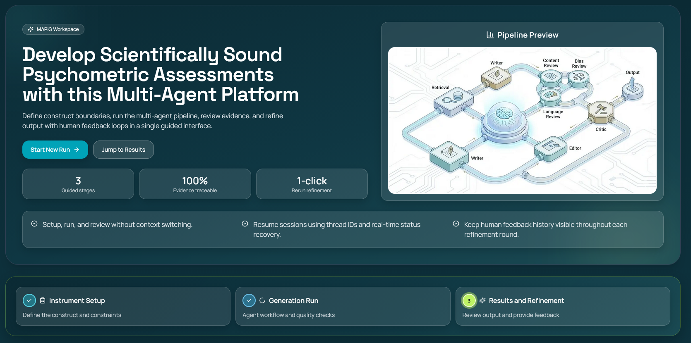

# MAPIG: Multi-Agent Psychometric Item Generator

Evidence-bounded, human-in-the-loop item generation for psychometric scale development.

MAPIG is a multi-agent platform that helps researchers generate psychometrically sound assessment items. You define a construct, and 13 specialized AI agents work together to gather evidence from the literature, map the construct's theoretical structure, draft Likert-type items, review them for clarity, bias, and construct alignment, revise based on feedback, and then evaluate the resulting scale's internal consistency and validity against published instruments. Every step is auditable, and a human feedback loop lets you refine items across rounds before moving to empirical piloting.

MAPIG generates candidate items and review artifacts. It supports expert judgment; it does not replace validation, piloting, or psychometric evaluation.


## Video Tutorial

[](https://youtu.be/E7Hq1bwF5sk?si=FKhQORlNa61qjNcP)

Watch the full walkthrough tutorial showing how to use MAPIG to generate psychometric items.

---

## How It Works

MAPIG follows the same logic a scale development team would use — just automated. You provide a construct definition, target population, and constraints. The system then moves through six phases:

1. **Gather evidence** from academic literature (local curated sources + live academic search)
2. **Map the construct's facet structure** so items cover the full theoretical breadth, not just synonym substitutions
3. **Draft items** guided by the facet map, evidence, and psychometric best practices
4. **Validate and review** every item on multiple dimensions, in parallel, with independent reviewers
5. **Decide and revise** — a critic agent accepts the items or sends them back for targeted editing (up to 3 rounds)
6. **Analyze the scale** — estimate inter-item correlations, internal consistency, convergent and discriminant validity against published instruments, and check for plagiarism

The result is a set of candidate items with full audit metadata, a synthetic correlation matrix, validity estimates, and all reviewer feedback preserved across iterations.

### Pipeline Flow

```
Evidence Gathering
  Retrieval Agent ──┐
  Web Surfer ───────┤
                    v
           Facet Mapper (construct structure analysis)
                    |
              Item Writer (draft items guided by facets)
                    |
              Validator (4-dimension scoring, up to 3 regeneration attempts)
                    |
        ┌───────────┼───────────┐
   Linguistic    Bias       Content        <- Triple Review (parallel)
   Reviewer    Reviewer    Reviewer
        └───────────┼───────────┘
                    |
                 Critic (accept or revise?)
                    |
         ┌──── accept ────┐──── revise ──> Meta Editor ──> back to Triple Review
         v
     Finalize (audit metadata, cost calculation)
         |
    ┌────┼────┐
    v    v    v
 Correlation  Instrument   Validity        <- Post-Finalization Analytics
 Estimator    Searcher     Scorer
    └────┼────┘
         v
   Final Output
```

---

## The 13 Agents

MAPIG uses 13 specialized AI agents, each with a single job. Think of them as a team of experts passing work down an assembly line — one gathers evidence, another maps the construct's theoretical structure, one drafts items guided by that structure, others review, one decides if revisions are needed, and the final group checks how good the items really are.

### Evidence Gathering

| Agent | What it does |
|-------|-------------|
| **Retrieval Agent** | Searches your **local approved sources** (curated research papers you upload) to find theoretical grounding for item writing. No AI model needed — pure text matching against your library. |
| **Web Surfer** | Queries **Perplexity's academic search** to find published research — seminal papers, measurement precedents, and construct definitions from peer-reviewed journals. Searches are restricted to approved academic domains (e.g., doi.org, psycnet.apa.org, Springer, Wiley, SAGE). Automatically retries with broadened queries if too few sources are found. |

### Construct Structure Analysis

| Agent | What it does |
|-------|-------------|
| **Facet Mapper** | The theoretical architect. Analyzes the retrieved evidence to **identify the construct's formal facet structure** before any items are written. This is what prevents the common problem of LLMs generating 10 items that are all rewordings of each other (e.g., "I shift my thinking", "I change my methods", "I adjust my plans" — essentially the same item asked different ways, producing inter-item correlations above r = 0.85). The Facet Mapper works in two modes: **Unidimensional** (default) treats the construct as a single factor, defines a strict "negative space fence" (what the construct is NOT), and flags any sub-constructs found in the literature so you can generate items for those separately. **Multi-dimensional** (user toggle) distributes items evenly across identified sub-constructs. |

### Item Creation

| Agent | What it does |
|-------|-------------|
| **Item Writer** | The creative engine. Takes the construct definition, evidence, **facet mapping**, and constraints, then **drafts Likert-type items** following psychometric best practices — no double-barreled items, appropriate reading level, positive keying only (per current best practice), and each item grounded in specific evidence with a rationale citing the source. When facet mapping is provided, items are distributed across facets to ensure semantic diversity and moderate inter-item correlations (target: r = 0.40-0.70). |
| **Validator** | The quality gate. **Scores every item on 4 weighted dimensions**: correspondence with the construct definition (50%), distinctiveness from neighboring constructs (25%), clarity for the target population (15%), and specificity of language (10%). Items scoring below 7.0/10 are sent back for regeneration — only the failed items, not the whole batch. The validator also detects "lazy" identical scores (where all items receive the same rating) and forces re-evaluation with a more powerful model. |

### Triple Review (runs in parallel)

Three independent reviewers evaluate all items simultaneously, each looking at a different aspect:

| Agent | What it does |
|-------|-------------|
| **Linguistic Reviewer** | Hunts for **readability problems** — vague quantifiers ("often", "sometimes" without time anchors), absolute terms ("always", "never"), double-barreled items, ambiguous wording, and cultural idioms that may not translate across groups. |
| **Bias Reviewer** | Checks for **fairness across groups**. Detects 7 types of bias that could cause differential item functioning (DIF): construct bias (culture-bound meanings), linguistic bias, cultural reference bias, socioeconomic bias (e.g., assuming access to a "private workspace at home"), context access bias, protected attribute bias, and intersectional bias (compounding effects across multiple types). Includes a construct-level filter that automatically suppresses false positives — when the same bias concern applies to every item identically (e.g., "individualism bias" flagged across the board for a Life Satisfaction scale), it is recognized as a construct-level issue, not an item-level problem. |
| **Content Reviewer** | Tests **construct alignment** by simulating expert judges rating how well each item matches the intended construct — and whether it accidentally measures something else (e.g., job satisfaction when you meant workplace belonging). Checks against common near-neighbor constructs and tracks facet coverage balance. |

### Decision & Revision

| Agent | What it does |
|-------|-------------|
| **Critic** | The decision-maker. Reads all reviewer feedback and decides: **accept the items or send them back for revision**. Uses adaptive thresholds that gradually relax over iterations to prevent infinite revision loops. Also detects stagnation — when revisions are just paraphrasing the same content without meaningful improvement — and force-accepts to move forward. |
| **Meta Editor** | The surgeon. When the critic says "revise", this agent **applies reviewer feedback precisely** — fixing only the flagged issues while preserving item count, facet balance, and construct fidelity. It will reject changes that would alter what the item measures (e.g., changing "I am satisfied with my life" to "My community is satisfied with life"). |

### Post-Finalization Analytics

| Agent | What it does |
|-------|-------------|
| **Correlation Estimator** | Estimates **how items relate to each other** before any empirical data collection, using the embedding-based method validated by Hommel & Arslan (2024). Produces a full inter-item correlation matrix, McDonald's omega, and internal consistency flags. |
| **Instrument Searcher** | Automatically **finds published scales** that measure the same or related constructs (e.g., finds the Satisfaction with Life Scale if you're building a life satisfaction measure, and the Flourishing Scale as a discriminant benchmark). Filters out commercial/proprietary instruments. Used for benchmarking your items against established instruments. |
| **Validity Scorer** | Estimates **convergent and discriminant validity** — how well your items align with similar instruments (should be high) and how distinct they are from different constructs (should be low). Also runs plagiarism detection to ensure your items are original, not paraphrased copies of existing scales. |

---

## Post-Finalization Analytics (Detail)

After items are finalized, three analytics stages run to give you psychometric quality indicators — all without needing to collect any empirical data first. These are estimates to guide your judgment, not replacements for proper piloting.

### Synthetic Inter-Item Correlations

Rather than requiring empirical data collection, MAPIG estimates inter-item correlations using the validated methodology from Hommel & Arslan (2024). Their research demonstrated that sentence transformer embeddings with cosine similarity accurately predict real correlations (r = .71 for items, r = .89 for scales, r = .86 for reliability estimates).

**How it works**: All generated items are converted into numerical vectors (embeddings) using OpenAI's `text-embedding-3-small` model. The system then computes pairwise cosine similarity between every item pair, producing a full N x N correlation matrix — the same format you would get from empirical data, but derived purely from the semantic content of the items.

From this matrix, MAPIG calculates:
- **McDonald's omega** (internal consistency estimate) — the same statistic you would compute from real survey data, estimated from the synthetic correlation matrix
- **Mean inter-item correlation** — flagged as "too low" if below r = 0.15 (items may not cohere as a scale), "too high" if above r = 0.50 (items may be redundant), or "optimal range" otherwise
- **Guidance text** based on Clark & Watson (1995) recommendations for scale breadth vs. internal consistency

This approach is fast (single API call, pure matrix math), deterministic, and grounded in published empirical validation.

**Reference**: Hommel, B. E., & Arslan, R. C. (2024). Language models accurately infer correlations between psychological items and scales from text alone. *European Journal of Psychological Assessment*. https://doi.org/10.1027/1015-5759/a000838

### Instrument Comparison & Convergent Validity

MAPIG automatically locates established instruments to benchmark your generated items against, supporting both convergent and discriminant validity estimation.

**Step 1: Find comparison instruments**

The Instrument Searcher queries Perplexity's academic search to find:
- A **convergent instrument** — one that directly measures the same or very similar construct (e.g., the Satisfaction with Life Scale for a "Life Satisfaction" construct)
- A **discriminant instrument** — one that measures a related-but-theoretically-distinct construct (e.g., the Flourishing Scale)

The search filters out commercial publishers (Pearson, PAR, MHS, WPS, Hogrefe) whose instruments cannot be freely compared, and extracts structured metadata: instrument name, authors, publication year, construct measured, and psychometric properties.

If academic search is unavailable, hardcoded fallbacks cover 5 psychological domains (wellbeing, burnout, resilience, engagement, belonging) with well-known open-access instruments.

**Step 2: Score convergent validity**

The Validity Scorer uses a **dual-direction approach** to mitigate position bias:
1. **Forward**: "How well do the generated items align with [comparison instrument]?"
2. **Reverse**: "How well does [comparison instrument] align with the generated items?"
3. The two scores are averaged for the final convergent validity estimate (0.0-1.0)

When possible, this uses embedding-based cross-scale similarity (computing the cosine similarity between the centroid of your items and the centroid of the comparison instrument's items). When published items are unavailable, it falls back to an LLM-as-judge approach using GPT-5.2 with high reasoning effort.

A convergent validity score above 0.85 triggers a warning — this may indicate your items are too derivative of the existing instrument rather than measuring the construct independently.

**Step 3: Plagiarism detection**

A sentence-transformer model computes semantic similarity between your generated items and any published item texts that were found. Items exceeding a 0.85 similarity threshold are flagged. This ensures generated items are original, not paraphrased copies of existing scales.

### Cross-Construct Discriminant Validity

The final analytics stage estimates how distinct your target construct is from related constructs:

1. Takes the discriminant instrument found in the comparison step
2. Uses the same dual-direction approach to estimate the expected correlation between your target construct and the comparison construct
3. Flags: "concern" if the estimated overlap is dangerously high (|r| > 0.85), "adequate" otherwise
4. Provides a construct pair analysis with reasoning about where the conceptual boundaries lie

This tells you whether your generated items are measuring what you claim — or whether they may be inadvertently capturing a neighboring construct.

---

## How the Pipeline Works (Phase by Phase)

### Phase 1: Evidence Retrieval

Two channels provide the theoretical grounding that every generated item cites:

- **Local approved sources**: Your own curated research papers, searched using deterministic text matching (no AI model needed)
- **Academic web search**: Queries Perplexity's `sonar-pro` model in academic mode with a domain allowlist (doi.org, psycnet.apa.org, Springer, Wiley, SAGE, etc.) to retrieve seminal papers, conceptual frameworks, measurement precedents, and boundary conditions. If a cultural group is specified, an additional search retrieves culturally relevant measurement literature.

Evidence chunks are tagged with metadata — authors, theoretical model names, and identified dimensions — so the item writer can ground each item in specific literature. The system targets 15-25 evidence chunks per run and will retry with broadened queries if too few sources are found.

### Phase 2: Facet Mapping

The **Facet Mapper Agent** analyzes the retrieved evidence to establish the construct's theoretical structure before any items are written. This is the key to generating diverse, non-redundant items.

**Why this matters**: Without facet mapping, LLMs tend to generate items that are synonym substitutions of each other (e.g., "I shift my thinking", "I change my methods", "I adjust my plans"). These produce inter-item correlations above 0.85 — essentially the same item asked 7 different ways. The facet mapper forces structural diversity by identifying distinct theoretical dimensions and allocating items across them.

**How it works**:
- **Unidimensional mode** (default): The construct is treated as a single factor. All items target the full construct. If the literature reveals sub-constructs (e.g., Burnout has Exhaustion, Cynicism, Inefficacy), they are **flagged as suggestions** for the user to generate items for separately — not split into sub-scales in the current run. A strict "negative space fence" defines what the construct is NOT, preventing drift into adjacent constructs.
- **Multi-dimensional mode** (user toggle): Items are distributed evenly across identified sub-constructs. Each facet gets an equal share of the total item count with mutually exclusive descriptions and boundary exclusions.

### Phase 3: Item Drafting

The **Item Writer Agent** receives the construct definition, target population, constraints, **facet mapping**, and evidence chunks, then generates Likert-type items following psychometric best practices:

- Facet-guided generation: items are distributed across facets with explicit behavioral referent variation
- Unidimensional focus per item
- Positive keying only (no reverse-coded items, per current best practice)
- Reading level matched to population (6th-8th grade general, 5th-6th clinical, 10th-12th professional)
- No double-barreled items, idioms, or vague quantifiers
- Each item includes a rationale (max 50 words) citing specific evidence sources

After generation, a diversity check flags batches where items are too semantically similar (mean pairwise similarity above 0.80).

### Phase 4: Validation Gate

The **Validator Agent** acts as an AI judge, scoring every item on four weighted dimensions:

| Dimension | Weight | What it measures |
|-----------|--------|-----------------|
| Correspondence | 50% | Does the item match the construct definition? |
| Distinctiveness | 25% | Is it clearly this construct, not a neighbor? |
| Clarity | 15% | Unambiguous, concise, comprehensible for the target population? |
| Specificity | 10% | Concrete language, avoids vague quantifiers? |

Items scoring below 7.0 (weighted) are regenerated — only the failed items, not the whole batch. This selective regeneration runs up to 3 attempts with escalating model power (Claude Sonnet first for cost-efficiency, Claude Opus on retries for maximum accuracy).

### Phase 5: Triple-Reviewer Fanout

Three independent reviewers run **in parallel**, each receiving a streamlined version of the request:

- **Linguistic Reviewer**: Readability, vague quantifiers, absolute terms, double-barreled items, cultural idioms. Simulates a 5-point appropriateness rating.
- **Bias Reviewer**: 7 DIF bias types (construct, linguistic, cultural reference, socioeconomic, context access, protected attribute, intersectional). Includes a construct-level filter that suppresses false positives when the same concern applies identically to all items.
- **Content Reviewer**: Construct correspondence and distinctiveness. Simulates 5 naive judges rating each item. Checks against near-neighbor constructs (job satisfaction, engagement, commitment, psychological safety, inclusion, social support, fairness, team cohesion).

### Phase 6: Critic Decision & Revision Loop

The **Critic Agent** decides whether items are ready or need another revision cycle, using **adaptive thresholds** that relax over iterations:

| Round | Mode | Acceptance standard |
|-------|------|---------------------|
| 1 | Strict | Only minor issues (severity 1-2), no medium+ concerns |
| 2 | Thorough | Tolerates 1 medium concern |
| 3 | Final | Tolerates up to 3 medium concerns, accepts severity up to 4 |

90% of decisions use zero AI tokens via rule-based logic — only borderline cases require AI judgment. Hard stop at 3 rounds prevents runaway loops.

**Stagnation detection**: If revisions are just paraphrasing the same content without meaningful improvement (detected via word-level similarity), the system force-accepts the current quality rather than cycling endlessly.

When revision is needed, the **Meta Editor** applies reviewer feedback surgically — fixing only the flagged issues while preserving item count and facet balance. Construct fidelity always takes priority over bias concerns, which take priority over linguistic suggestions. After editing, revised items go back through the triple review for re-evaluation.

### Phase 7: Finalization & Analytics

Once the critic accepts (or the hard stop fires), the system:
1. Assembles audit metadata: all reviewer comments across iterations, validation results per item, token usage, cost breakdown, stop reason, iteration count
2. Runs the analytics pipeline in parallel: correlation estimation + instrument comparison simultaneously, then cross-construct validity (which depends on the comparison results)

---

## LLM Allocation Strategy

MAPIG allocates different AI models to different agents based on task complexity and cost:

| Agent | Default Model | With ChatGPT Toggle | Notes |
|-------|---------------|---------------------|-------|
| Facet Mapper | Claude Sonnet 4.5 | Claude Sonnet 4.5 | Construct structure analysis |
| Item Writer | Claude Sonnet 4.5 | Claude Sonnet 4.5 | Always Sonnet (quality-critical) |
| Validator | Sonnet 4.5 / Opus 4.6 | GPT-4o | Sonnet first, Opus on retries |
| Linguistic Reviewer | Claude Sonnet 4.5 | GPT-4o | |
| Bias Reviewer | GPT-4o-mini | GPT-4o | 20x cheaper, acceptable accuracy |
| Content Reviewer | Claude Sonnet 4.5 | GPT-4o | |
| Critic | GPT-4o-mini | GPT-4o | 90% rule-based (0 tokens) |
| Meta Editor | Claude Sonnet 4.5 | Claude Sonnet 4.5 | Always Sonnet |
| Correlation Estimator | OpenAI embeddings | OpenAI embeddings | text-embedding-3-small |
| Validity Scorer | GPT-5.2 | GPT-5.2 | Reasoning model, high effort |

### Cost Optimizations
- **Smart validation**: Sonnet on attempt 1 (80% cheaper), Opus only on retries
- **Efficient reviewers**: Bias reviewer and critic use GPT-4o-mini (20x cheaper than GPT-4o)
- **Rule-based critic**: 90% of accept/reject decisions use 0 tokens
- **Prompt caching**: Claude system prompts are cached (50% input cost reduction)
- **Smart filtering**: Meta-editor only receives high-severity comments (40-60% token reduction)
- **Minimal payloads**: Reviewers receive abbreviated context (60% smaller requests)
- **Selective regeneration**: Only failed items are regenerated, not the entire batch

**Typical run cost** (10 items, 1-2 revision rounds): $0.80-$1.50

---

## Product Highlights



- **Guided three-step UI**: Setup (define construct) -> Generation Run (watch progress) -> Results (review items)
- **Session recovery**: Active sessions can be restored after closing/reopening the browser
- **Human feedback loop**: Review generated items, add feedback, and rerun — feedback history is tracked per round
- **Evidence trail**: Grouped, clickable web sources and local curated references
- **Full audit metadata**: Every run records thread ID, run ID, iteration count, stop reason, model info, and cost breakdown
- **Inter-item correlation heatmap**: Visual matrix with hover tooltips and confidence intervals, plus McDonald's omega
- **Instrument comparison**: Convergent and discriminant validity with score badges showing r-values and links to source papers
- **Export options**: CSV, JSON, and Markdown export of items and correlation matrices

---

## Getting Started

### 1) Install dependencies
```bash
# Backend (Python, via Poetry)
poetry install

# Frontend (Next.js, at repo root)
npm install
```

### 2) Configure environment
Create `.env` in the repository root:

```env
APP_MODE=openai
OPENAI_API_KEY=YOUR_KEY
OPENAI_MODEL=gpt-5.2

SEARCH_PROVIDER=hybrid
PERPLEXITY_API_KEY=YOUR_KEY
PERPLEXITY_BASE_URL=https://api.perplexity.ai/v2
PERPLEXITY_MODEL=sonar-pro
PERPLEXITY_SEARCH_MODE=academic
PERPLEXITY_MAX_RESULTS=20
PERPLEXITY_DOMAIN_FILTER=doi.org,psycnet.apa.org,link.springer.com,sciencedirect.com,onlinelibrary.wiley.com,tandfonline.com,journals.sagepub.com,academic.oup.com,cambridge.org
```

### 3) Run
```bash
npm run dev          # Runs frontend + backend together
```

Or separately:
```bash
npm run dev:frontend                              # Next.js only (port 3000)
python -m uvicorn backend.main:app --reload       # Backend only (port 8000)
```

API docs available at: `http://127.0.0.1:8000/docs`

### Example Request
```json
{
  "construct_name": "Workplace belonging",
  "construct_definition": "A sustained sense of being accepted, included, and valued as a legitimate member of one's work community.",
  "construct_exclusions": "Exclude job satisfaction and work engagement; keep focus on social inclusion and acceptance.",
  "target_population": "Full-time employees in a hybrid work setting",
  "response_scale": "5-point Likert: Strongly disagree to Strongly agree",
  "item_count": 10,
  "constraints": [
    "Avoid references to organization-specific jargon",
    "Keep items under 20 words"
  ],
  "approved_domains": [
    "doi.org",
    "psycnet.apa.org",
    "link.springer.com"
  ]
}
```

### Human Feedback Reruns
The UI supports iterative refinement:
1. Generate the initial item set
2. Review results and add feedback
3. Rerun — the system uses your feedback and previous items as context
4. Repeat until satisfied

Feedback history is tracked per round in the Results view.

---

## API Reference

### Required Input Fields
- `construct_name` — name of the psychological construct
- `construct_definition` — precise operational definition
- `target_population` — who will respond to the items
- `response_scale` — e.g., "5-point Likert: Strongly disagree to Strongly agree"

### Optional Input Fields
- `item_count` (default 10, range 2-50)
- `constraints` — additional rules beyond baseline (additive, not replacement)
- `construct_exclusions` — what this construct is not, overlap boundaries
- `native_construct` — original language if construct was translated
- `example_item` — reference only, will not be copied
- `cultural_group` — triggers culturally-sensitive evidence search
- `language` — target language for generated items
- `approved_domains` — per-request academic domain allowlist
- `exclude_sources` — domains to block
- `human_feedback` — free-text feedback from previous round
- `previous_items` — items from previous round for refinement
- `model_provider` — `"claude"` or `"openai"`
- `use_chatgpt_critics` — use GPT-4o for reviewer agents
- `use_gpt52_analytics` — enable GPT-5.2 reasoning models for analytics
- `is_unidimensional` (default true) — single scale (sub-constructs flagged) vs. multi-dimensional (items distributed across sub-constructs)

### Output Fields
- `final_items[]` — generated items with text, rationale, evidence citations, validation scores
- `audit` — thread_id, run_id, iteration_count, stop_reason, cost breakdown, model info
- `correlation_matrix` — pairwise correlations, McDonald's omega, mean r, consistency flag, guidance text
- `comparison_instruments[]` — convergent and discriminant instruments found
- `convergent_validity_score` — 0.0-1.0
- `cross_construct_analysis` — discriminant validity results, construct pair analysis
- `plagiarism_flags` — any items flagged for similarity to published items
- `linguistic_feedback`, `bias_feedback`, `content_feedback` — all reviewer comments

### Constraints Model

MAPIG applies constraints in two layers:

1. **Standard baseline constraints** (always active):
   - No double-barreled items
   - Avoid idioms
   - Minimize reading level
   - Positively keyed only

2. **Additional user constraints**:
   - Anything provided in `constraints` is added on top of the baseline
   - User constraints are treated as additive, not replacements

### Approved Sources Policy

MAPIG supports two evidence channels:
- Local curated sources in `data/approved_sources/`
- Web retrieval constrained to an approved domain allowlist

Web retrieval requires allowlisted domains — configure `PERPLEXITY_DOMAIN_FILTER` in `.env`, or send `approved_domains` per request.

---

## Deployment (Vercel)

MAPIG deploys as a **single Vercel project** with unified frontend and backend.

- **Frontend**: Next.js at repository root
- **Backend**: Python serverless functions in `/api` directory
- **Single domain**: Same-origin architecture, no CORS configuration needed

### Deployment Steps

1. **Connect repository to Vercel** — framework preset: Next.js (auto-detected)
2. **Set environment variables** in Vercel Dashboard:
   ```
   CLAUDE_API_KEY=<your-anthropic-key>
   OPENAI_API_KEY=<your-openai-key>
   APP_MODE=claude
   SEARCH_PROVIDER=perplexity
   PERPLEXITY_API_KEY=<your-perplexity-key>
   PERPLEXITY_DOMAIN_FILTER=doi.org,psycnet.apa.org,...
   NEXT_PUBLIC_API_URL=https://your-project.vercel.app
   ```
3. **Push to main branch** for auto-deploy (preview deployments created for PRs)

**Notes**: Vercel Pro plan recommended (300s function timeout). Typical runs complete in 20-40s. In-memory checkpointing means sessions do not persist across server restarts.

---

## Repository Structure

```
lmaig-langgraph/
├── api/                    # Vercel serverless entry point
│   └── index.py           # Exports FastAPI app for Vercel
├── backend/               # FastAPI application code
│   ├── main.py           # App, routes, SSE streaming
│   ├── graph.py          # LangGraph workflow definition (all nodes + routing)
│   ├── agents/           # Agent implementations
│   │   ├── facet_mapper.py         # Construct facet identification
│   │   ├── item_writer.py          # Drafts items guided by facet mapping
│   │   ├── validator.py            # 4-dimension scoring + identical-score detection
│   │   ├── linguistic_reviewer.py  # Clarity, readability, grammar
│   │   ├── bias_reviewer.py        # 7 DIF bias types + construct-level filter
│   │   ├── content_reviewer.py     # Construct correspondence + distinctiveness
│   │   ├── critic.py               # Accept/revise routing with adaptive thresholds
│   │   ├── meta_editor.py          # Applies reviewer feedback surgically
│   │   ├── retrieval_agent.py      # Local approved source search
│   │   ├── web_surfer.py           # Perplexity academic search
│   │   ├── correlation_estimator.py # Embedding-based inter-item correlations
│   │   ├── instrument_searcher.py  # Finds convergent/discriminant instruments
│   │   ├── validity_scorer.py      # Convergent + discriminant validity estimation
│   │   ├── sanitizer.py           # Prompt injection defense
│   │   ├── llm_factory.py         # Model selection + agent overrides
│   │   ├── llm_utils.py           # Structured output invocation
│   │   └── prompt_loader.py       # Loads agent system prompts
│   ├── analytics/         # Post-finalization analytics
│   │   ├── omega_calculator.py     # McDonald's omega from correlation matrix
│   │   └── similarity_calculator.py # Plagiarism detection (sentence-transformers)
│   ├── prompts/           # Agent system prompts (.md files)
│   ├── schemas.py         # All data models
│   └── settings.py        # Environment configuration
├── src/                   # Next.js frontend (App Router)
│   ├── app/              # Pages
│   ├── components/       # React components (shadcn/ui)
│   └── lib/              # Utilities, API client, types, schemas
├── public/               # Static assets (architecture diagram, screenshots)
├── data/                 # Approved sources for evidence retrieval
├── tests/                # Backend tests
├── next.config.js        # Next.js configuration
├── vercel.json           # Vercel serverless config
├── package.json          # Frontend dependencies
├── pyproject.toml        # Backend dependencies (Poetry)
└── README.md
```

## Testing
```bash
npm run build      # Frontend production build
npm run type-check # TypeScript validation
npm test           # Frontend tests (Vitest)
pytest -q          # Backend tests
```

---

## Contributing
Issues and pull requests are welcome for:
- Stability fixes
- Prompt and reviewer quality improvements
- UX and accessibility improvements
- Performance and observability upgrades

## Maintainer
Created by Prof. Llewellyn E. van Zyl (Ph.D)
Website: https://www.psynalytics.com
Personal: https://www.llewellynvanzyl.com
GitHub: https://github.com/llewellynvz

## License
This is proprietary software. Personal, academic, and internal research use is permitted. Redistribution and commercial use are not permitted.

## References

Hommel, B. E., & Arslan, R. C. (2024). Language models accurately infer correlations between psychological items and scales from text alone. *European Journal of Psychological Assessment*. https://doi.org/10.1027/1015-5759/a000838

Lee, P., Son, M., & Jia, Z. (2025). AI-powered automatic item generation for psychological tests: A conceptual framework for an LLM-based multi-agent AIG system. *Journal of Business and Psychology*, 1-29.

Clark, L. A., & Watson, D. (1995). Constructing validity: Basic issues in objective scale development. *Psychological Assessment*, 7(3), 309-319.
