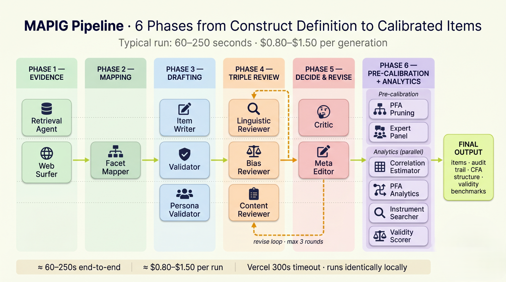

# MAPIG: Multi-Agent Psychometric Item Generator

**Generate psychometrically sound assessment items in minutes, not weeks — with a full audit trail you can trust.**

MAPIG is a research-grade web app that helps researchers, psychometricians, and clinicians draft survey items for new (or existing) psychological constructs. Type in what you want to measure, and a team of specialised AI agents will gather the academic evidence, map the construct's facet structure, draft Likert items, review them for clarity and bias, refine them through multiple rounds, and then estimate the scale's reliability and validity — all before you recruit a single respondent.


## Video tutorial

[](https://youtu.be/E7Hq1bwF5sk?si=FKhQORlNa61qjNcP)

A full walkthrough — how to define a construct, run the pipeline, read the results.

---

## Table of contents

1. [What MAPIG does](#what-mapig-does)
2. [Pipeline at a glance](#pipeline-at-a-glance)
3. [The agents — at a glance](#the-agents--at-a-glance)
4. [Pre-calibration analytics](#pre-calibration-analytics)
5. [LLM allocation & cost](#llm-allocation--cost)
6. [Observability & audit trail](#observability--audit-trail)
7. [Getting started](#getting-started)
8. [Testing (unit + Playwright E2E)](#testing-unit--playwright-e2e)
9. [Repository structure](#repository-structure)
10. [Deployment (Vercel)](#deployment-vercel)
11. [API reference](#api-reference)
12. [References](#references)

---

## What MAPIG does

You give MAPIG four things:

1. **A construct name** (e.g., `Workplace belonging`)
2. **A precise definition** (what it is, what it isn't)
3. **A target population** (e.g., `full-time employees in hybrid work`)
4. **A response scale** (e.g., `5-point Likert: Strongly disagree to Strongly agree`)

Then it runs a six-phase, end-to-end pipeline:

| Phase | What happens | Why it matters |
|---|---|---|
| **1. Evidence gathering** | Searches your local research library + Perplexity's academic search for theoretical grounding. | Items must be *evidence-anchored*, not invented. |
| **2. Construct mapping** | Identifies the construct's facets (sub-dimensions) before writing anything. | Prevents 10 items that are all synonyms of each other. |
| **3. Item drafting** | Generates Likert items, slightly over-generated so weak ones can be pruned. | Drafts that respect facets, evidence, and best practices. |
| **4. Validation + review** | Validates each item on 4 dimensions; three reviewers (linguistic / bias / content) run in parallel. | Quality gate with multiple independent angles. |
| **5. Critic & revise** | A critic decides accept-or-revise; a meta-editor surgically applies feedback. | Up to 3 revision rounds with adaptive thresholds. |
| **6. Pre-calibration analytics** | Persona check, PFA pruning, expert panel, factor analysis, instrument benchmarking, plagiarism. | Tells you what you have *before* recruiting respondents. |

The output: candidate items + a structural report (factor recovery, reliability, validity benchmarks, expert verdicts) + a complete audit trail.

---

## Pipeline at a glance



```
                    ┌─ Retrieval Agent (local sources)
Evidence gathering ─┤
                    └─ Web Surfer (Perplexity academic search)
                                │
                                ▼
                       Facet Mapper  ← decides facet structure
                                │
                                ▼
                       Item Writer  ← drafts ~1.3× requested items
                                │
                                ▼
                  ┌─ Validator (4-dim scoring, up to 3 attempts)
 Validation gate ─┤
                  └─ Persona Validator (cognitive interview, 3 personas)
                                │
                ┌───────────────┼───────────────┐
                ▼               ▼               ▼
       Linguistic      Bias            Content       (parallel)
        Reviewer    Reviewer         Reviewer
                └───────────────┼───────────────┘
                                ▼
                            Critic ── revise ──▶ Meta Editor ──┐
                                │       (loop, max 3 rounds)   │
                              accept                          ◀┘
                                │
                                ▼
                       PFA Pruning  ← drops weak items via factor analysis
                                │
                                ▼
                      Expert Panel  ← psychometric / domain / localization
                       (3 experts + 1 debate round + IRR)
                                │
                                ▼
                  Meta Editor (one final pass)
                                │
                                ▼
                          Finalize
                                │
            ┌───────────────────┼───────────────────┐
            ▼                   ▼                   ▼
     Correlation +      Instrument          Cross-construct
       PFA Analytics     Comparison +         Discriminant
     (parallel)        Validity + Plagiarism  Validity
                                │
                                ▼
                       Final Output (with full audit)
```

**Total typical runtime**: 60–250 seconds depending on iteration count and Perplexity latency.

---

## The agents — at a glance

MAPIG runs **17 specialised agents** that pass work down an assembly line. Each one has a single, clear job. Here's what each one does, grouped by phase.

### Phase 1 — Evidence gathering

The librarians. They find the academic grounding so every item is anchored in real research.

| Agent | What it does |
|---|---|
| 📚 **Retrieval Agent** | Searches your local research library for theoretical grounding. No LLM, no API cost. |
| 🌐 **Web Surfer** | Searches Perplexity's academic mode for peer-reviewed evidence — restricted to a domain allowlist (DOI, APA, Springer, Wiley, SAGE, Cambridge, etc.). |

### Phase 2 — Construct architecture

| Agent | What it does |
|---|---|
| 🗺️ **Facet Mapper** | Identifies the construct's facets (sub-dimensions) before any items are written. Prevents the classic problem of 10 items that are all paraphrases of each other. |

### Phase 3 — Item creation & quality gate

| Agent | What it does |
|---|---|
| ✍️ **Item Writer** | Drafts Likert items grounded in evidence, following best practices. Over-generates by ~1.3× so weak items can be pruned later. |
| ✅ **Validator** | Scores every item on 4 weighted dimensions (correspondence, distinctiveness, clarity, specificity). Items below 7/10 get regenerated automatically. |
| 👥 **Persona Validator** | Three respondent personas read each item like real users would. Items where personas disagree by ≥ 2 points get flagged for ambiguity. |

### Phase 4 — Triple review (parallel)

Three independent reviewers run at the same time, each looking at a different angle.

| Agent | What it does |
|---|---|
| 📖 **Linguistic Reviewer** | Catches readability problems: vague quantifiers, idioms, double-barreled items, ambiguous wording. |
| ⚖️ **Bias Reviewer** | Detects 7 types of differential item functioning bias (cultural, linguistic, socioeconomic, intersectional, …). |
| 🎯 **Content Reviewer** | Tests construct alignment — does each item really measure what we said? Or is it drifting into a neighbouring construct? |

### Phase 5 — Decide & revise

The decision-makers. They run a tight loop: at most 3 rounds, with adaptive thresholds and a stagnation safety net.

| Agent | What it does |
|---|---|
| 🤔 **Critic** | Decides accept or revise based on all reviewer feedback. 90% of the time it decides without using any LLM tokens (rule-based fast path). |
| ✂️ **Meta Editor** | Surgically applies the reviewer feedback to fix only the flagged issues — without breaking what's already working. |

### Phase 6 — Pre-calibration

Once the items are clean, two structural-validity checks run before the final analytics.

| Agent | What it does |
|---|---|
| 🧮 **PFA Pruning** | Runs factor analysis on item embeddings (Pseudo-Factor Analysis). Drops items that don't load cleanly on their parent factor. |
| 👨‍🔬 **Expert Panel** | Three experts (psychometric, domain, localization) score the items, debate one round, and agree on any final revisions. |

### Phase 7 — Post-finalization analytics (parallel)

The final report card. All four run simultaneously to estimate the scale's quality before you collect any data.

| Agent | What it does |
|---|---|
| 📊 **Correlation Estimator** | Estimates inter-item relationships from embedding cosine similarity, with a pseudo-alpha (semantic) consistency estimate — a pre-data signal, honestly labeled, not respondent statistics. |
| 📐 **PFA Analytics** | Reports the final factor structure as a CFA path diagram (η, λ, ε, φ) with full measurement equations. |
| 🔍 **Instrument Searcher** | Finds published scales for benchmarking — one that measures the same construct (convergent), one that measures a related-but-distinct one (discriminant). |
| 🧪 **Validity Scorer** | Estimates convergent and discriminant validity against those benchmarks + checks every item for plagiarism against known instruments. |
| 🧬 **Synthetic Pilot** (opt-in) | Simulated respondents with drawn trait levels rate every item, then real classical statistics run on the matrix: Pearson correlations with confidence intervals, Cronbach's alpha, omega, parallel analysis, KMO, Bartlett. Every number is labeled synthetic — item triage only. |
| 🕸️ **EGA/UVA** | Network-based dimensionality signal (community detection on the item network) plus redundancy detection: item pairs that overlap too much get flagged and prioritized for pruning. |
| 💬 **Qualitative Questions** (opt-in) | Open-ended, cognitive-interview-style probe questions for pre-testing the construct with real people, grounded in the same facet mapping and evidence. |

---

### Behind the scenes

These aren't "agents" in the LLM sense, but they're what makes the rest work cleanly.

| Module | Job |
|---|---|
| `sanitizer` | Prompt-injection defense + flags when your construct name and definition seem to describe different things. |
| `llm_factory` | Routes each agent to the right model (Sonnet, Opus, GPT-5.4-mini, GPT-5.2) based on the task. |
| `llm_utils` | Wraps every LLM call with structured-output parsing, token tracking, prompt caching, and one structured `LLM_CALL` log line per call. |
| `prompt_loader` | Loads each agent's `.md` system prompt with a shared prefix. |
| `krippendorff` | Pure-NumPy Krippendorff's α + Cohen's κ + Spearman ρ — used by the Expert Panel for inter-rater reliability. |
| `omega_calculator` | Pseudo-alpha (standardized alpha formula on the semantic similarity matrix). |
| `similarity_calculator` | Sentence-transformer plagiarism detection. |
| `checkpoint_config` | LangGraph in-memory checkpointer with all custom types pre-registered. |

---

## Pre-calibration analytics

Beyond the per-agent descriptions above, here's how the analytics tell the full picture of a scale's quality.

### Synthetic inter-item correlations (Hommel & Arslan, 2024)

Real scale validation needs respondent data. But before piloting, MAPIG estimates the inter-item correlation matrix from item embeddings alone:

- All items go through `text-embedding-3-large`
- Pairwise cosine similarity matrix (labeled as semantic similarity, not correlation)
- Pseudo-alpha (semantic) + mean inter-item similarity calculated
- Flags: `optimal_range` (0.15–0.50), `too_low` (items don't cohere), `too_high` (redundant)
- Pairs with r > 0.75 are flagged as redundant for review

### Factor structure (Pseudo-Factor Analysis)

EFA on the embedding-based correlation matrix using `factor-analyzer`:

| Metric | What it tells you |
|---|---|
| **Tucker's congruence** (`φ`) | How well factors match the expected facet structure. > 0.85 fair, > 0.95 excellent (Lorenzo-Seva & ten Berge 2006). |
| **Factor recovery rate** | % of expected factors successfully recovered (≥ 50% of expected items load on the right factor at ≥ 0.30). |
| **RMSR** (Root Mean Square Residual) | Lower is better. < 0.05 = good fit. |
| **CAF** (Common-Part Accounted For) | Higher is better. > 0.70 = good. |
| **Identifiability** | `over_identified` (typical) / `identified` / `saturated` (when n_items ≤ n_factors + 2; fit indices uninformative). |

**UI rendering: a CFA path diagram in the textbook style.** The PFA Panel shows your factor structure exactly the way you'd draw it on a whiteboard for a methods paper:

- **`η`** (eta) ellipses for latent factors, labelled with the factor name + φ
- **`xᵢ`** rectangles for item indicators
- **`λ`** loading paths from η to each xᵢ (thick green for primary loadings ≥ 0.30; thin grey for cross-loadings)
- **`εᵢ`** residual circles to the right of each item, with uniqueness `1 − λ²` shown
- A **measurement equations** block underneath: one line per item in the form `x₁ = 0.73 · η + ε₁ (Var(ε) ≈ 0.47)`

This makes the structural model interpretable at a glance — both for psychometricians (who get the standardized solution they expect) and for non-specialists (who can read what each item is "doing" in the model).

The **factor sign indeterminacy** problem is handled automatically: after EFA converges, each factor column is reflected so that its dominant loading is positive (Mulaik 2010 / Lorenzo-Seva & ten Berge 2006 convention). This means loadings on `Wellbeing` items always come out positive when items measure wellbeing — no more confusing all-negative loadings just because `oblimin` picked the reflected solution.

### Convergent / discriminant / cross-construct validity

- **Convergent validity** (vs. an instrument measuring the same construct): higher is better, but > 0.85 is suspiciously derivative.
- **Discriminant validity** (vs. an instrument measuring a related-but-distinct construct): lower is better, > 0.85 is a concern.
- **Cross-construct analysis**: explicit reasoning about expected vs. estimated overlap.

### Plagiarism detection

Sentence-transformer-based check against known item texts in `data/known_instrument_items/`. Items > 0.85 similar to a published item are flagged.

---

## LLM allocation & cost

MAPIG is deliberately stingy with expensive models. Cheap models do the volume work; quality-critical agents always get Sonnet or better.

| Agent | Default model | With `use_chatgpt_critics` toggle | Why this model |
|---|---|---|---|
| Facet Mapper | Claude Sonnet 4.5 | Same | Construct decomposition needs reasoning. |
| Item Writer | Claude Sonnet 4.5 | Same (always Sonnet) | Quality-critical, never downgraded. |
| Validator | Sonnet 4.5 → Opus 4.6 (smart escalation) | GPT-4o on critic-toggle | Sonnet is fast & cheap; Opus catches what Sonnet misses on retry. |
| Linguistic Reviewer | Claude Sonnet 4.5 | GPT-4o | Nuanced language judgments. |
| Bias Reviewer | **GPT-5.4-mini** | GPT-4o | Fairness signals don't need a flagship model; 20× cheaper. |
| Content Reviewer | Claude Sonnet 4.5 | GPT-4o | Construct fidelity is reasoning-heavy. |
| Critic | **GPT-5.4-mini** | GPT-4o | 90% rule-based (zero tokens); LLM only for borderline. |
| Meta Editor | Claude Sonnet 4.5 | Same | Surgical editing demands precision. |
| Persona Validator | **GPT-5.4-mini** | Same | Multiple persona calls; cost-controlled. |
| Expert Panel (× 3) | **GPT-5.4-mini** | Same | 3 + 3 = up to 6 calls; cost-controlled. |
| Correlation Estimator | OpenAI embeddings (`text-embedding-3-small`) | Same | Embeddings, not chat. |
| PFA Estimator | OpenAI embeddings (`text-embedding-3-large`) | Same | Higher-quality embeddings for factor analysis. |
| Instrument Searcher | Perplexity `sonar-pro` (academic mode) | Same | Built for citations. |
| Validity Scorer | GPT-5.2 (high reasoning) | Same | Dual-direction LLM-as-judge benefits from strong reasoning. |

### Cost optimizations

- **Smart validation tier**: Sonnet on attempt 1, Opus only on retries (~80% savings on items that pass first try).
- **Rule-based critic**: ~90% of accept/revise decisions use 0 LLM tokens.
- **Prompt caching**: Claude system prompts are cached (50% input cost reduction on Anthropic).
- **Smart comment filtering**: Meta-editor only sees severity ≥ 3 comments (40–60% token reduction).
- **Abbreviated payloads**: Reviewers receive a stripped UserRequest (~60% smaller than full).
- **Selective regeneration**: Only failed items are regenerated, never the whole batch.
- **Capped over-generation**: Item writer adds ≤ 5 extras (default factor 1.3, hard cap), not 2× — keeps validation cost bounded.

**Typical run cost** (10 items, 1–2 revision rounds, expert panel + analytics): **$0.80–$1.50**.

---

## Observability & audit trail

Every step of the pipeline emits structured log lines that are grep-friendly in Vercel logs or your terminal:

| Log prefix | What it tells you |
|---|---|
| `STEP_START` / `STEP_END` | Every node's start and end with elapsed time. |
| `LLM_CALL agent=X provider=Y model=Z elapsed=Ts input_tokens=N output_tokens=M cache_read=K schema=S status=ok\|fallback\|fail` | Every LLM invocation. p50/p99 latency, cache hit rate, schema validation success/failure are all derivable. |
| `VALIDATOR_FAIL_DETAIL item_idx=N attempt=K weighted=X correspondence=… distinctiveness=… clarity=… specificity=… low_dims=[…]` | Per-failed-item diagnostics. |
| `VALIDATION_RETRY_TRIGGER attempt=K/3 failed_items=[…] failed_scores=[…] reason=below_threshold` | Why a regen cycle fired. |
| `VALIDATOR_MODEL_ESCALATION attempt=K from=Sonnet to=Opus reason=…` | Smart-validation tier transitions. |
| `CRITIC_DECISION iteration=K mode=strict\|thorough\|final path=rule_based\|llm decision=accept\|revise severities={…} reason=…` | Every critic decision with full context. |
| `STAGNATION_CHECK iteration=K jaccard=X threshold=0.7 fired=…` | Why the stagnation safety net did or didn't trip. |
| `RULE_BASED_FAST_PATH …` | Fired when the rule-based critic falls through to the LLM. |
| `PFA_EMBED` / `PFA_COSINE_MATRIX` / `PFA_EFA_SOLVER` / `PFA_LOADINGS_RAW` / `PFA_SIGN_ALIGNMENT` / `PFA_TUCKER` / `PFA_RETENTION` / `PFA_VERDICT` | Full PFA stage-by-stage trace. |
| `EXPERT_PANEL start n_items=N debate_enabled=… time_budget=…s` / `EXPERT_PANEL_DEGRADED` / `EXPERT_PANEL_PARTIAL` | Expert panel lifecycle and graceful-degradation events. |
| `PERSONA_VALIDATOR start` / `PERSONA_TRUNCATED` / `PERSONA_VALIDATOR_PARTIAL` | Persona stage diagnostics. |
| `COMPARISON_PHASE start/done` + sub-step timings (`COMPARISON_SEARCH_INSTRUMENTS`, `COMPARISON_CONVERGENT_VALIDITY`, `COMPARISON_PLAGIARISM_CHECK`) | Where time is spent in the analytics phase. |

### Audit metadata in `FinalOutput`

Every run produces:

- `audit.thread_id`, `audit.run_id`, `audit.timestamp_utc`
- `audit.iteration_count`, `audit.stop_reason`
- Per-model token counts: `opus_tokens_used`, `sonnet_tokens_used`, `openai_tokens_used`, etc.
- Per-model cost in USD: `opus_cost`, `sonnet_cost`, `openai_cost`, `chatgpt_cost`, `total_cost`
- Cache metrics: `cache_read_tokens`, `cache_savings_usd`
- Quality flags: `force_accepted_below_threshold`, `forced_scores`, `warnings` (e.g., construct/definition mismatch)
- `iteration_history`: snapshot of every reviewer's comments per iteration (preserved across the loop, not lost)

---

## Getting started

### 1. Install dependencies

```bash
# Backend (Python via Poetry — or pip + requirements.txt)
poetry install

# Frontend (Next.js)
npm install
```

### 2. Configure environment

Create `.env` in the repo root:

```env
# Mode
APP_MODE=claude                 # or "openai" or "mock"

# Model providers
CLAUDE_API_KEY=sk-ant-...
OPENAI_API_KEY=sk-...

# Web search
SEARCH_PROVIDER=perplexity      # or "local" or "hybrid"
PERPLEXITY_API_KEY=pplx-...
PERPLEXITY_DOMAIN_FILTER=doi.org,psycnet.apa.org,link.springer.com,sciencedirect.com,onlinelibrary.wiley.com,tandfonline.com,journals.sagepub.com,academic.oup.com,cambridge.org
```

### 3. Run locally

```bash
npm run dev      # runs Next.js (port 3000) + uvicorn backend (port 8000) together
```

The app is available at `http://localhost:3000`. API docs at `http://localhost:8000/docs`.

### 4. Mock mode (for development without API costs)

```bash
APP_MODE=mock SEARCH_PROVIDER=local npm run dev
```

The full pipeline runs end-to-end with deterministic stub responses — perfect for UI development or running the Playwright E2E.

---

## Testing (unit + Playwright E2E)

### Backend unit tests

```bash
pytest                    # full suite (~280 tests)
pytest -W error           # zero-warning gate (treat warnings as errors)
pytest tests/test_smoke.py -v   # end-to-end mock-mode pipeline test
```

### Frontend type-check + build

```bash
npm run type-check
npm run build
npm test                  # Vitest component tests
```

### Playwright end-to-end

```bash
# One-time: install Chromium binary
npm run e2e:install

# Terminal 1: start dev server in mock mode
APP_MODE=mock SEARCH_PROVIDER=local npm run dev

# Terminal 2: run the E2E
npm run e2e
```

The single E2E spec (`tests-e2e/full-generation.spec.ts`) submits the form, waits for the streamed pipeline to complete, and asserts the major panels render (PFA, Expert, Persona, Items). It skips gracefully if the dev server isn't reachable, so it's safe to add to CI.

---

## Repository structure

```
lmaig-langgraph/
├── api/
│   └── index.py                     # Vercel serverless entry → exports FastAPI `app`
├── backend/
│   ├── main.py                      # FastAPI: routes, SSE streaming, run registry
│   ├── graph.py                     # LangGraph workflow: nodes, routing, state
│   ├── schemas.py                   # All Pydantic models (UserRequest, FinalOutput, …)
│   ├── settings.py                  # Environment configuration + feature flags
│   ├── checkpoint_config.py         # LangGraph checkpointer with custom-type registration
│   ├── logging_utils.py             # `step()` context manager, structured logs
│   ├── agents/
│   │   ├── retrieval_agent.py       # Local source search (no LLM)
│   │   ├── web_surfer.py            # Perplexity academic search
│   │   ├── facet_mapper.py          # Construct facet decomposition
│   │   ├── item_writer.py           # Drafts items, over-generation
│   │   ├── validator.py             # 4-dim scoring + smart escalation
│   │   ├── persona_validator.py     # Cognitive-interview personas
│   │   ├── linguistic_reviewer.py
│   │   ├── bias_reviewer.py
│   │   ├── content_reviewer.py
│   │   ├── critic.py                # Adaptive thresholds + stagnation
│   │   ├── meta_editor.py           # Surgical revision + polarity guard
│   │   ├── pfa_pruning.py           # Iterative item pruning
│   │   ├── pfa_estimator.py         # PFA core: EFA + sign alignment + retention
│   │   ├── expert_panel.py          # Multi-expert face/content validity
│   │   ├── correlation_estimator.py # Embedding-based correlations
│   │   ├── instrument_searcher.py
│   │   ├── validity_scorer.py
│   │   ├── sanitizer.py             # Injection defense + coherence check
│   │   ├── llm_factory.py           # Model routing
│   │   ├── llm_utils.py             # Structured output + LLM_CALL logs
│   │   └── prompt_loader.py
│   ├── analytics/
│   │   ├── pfa_analytics.py         # Post-final PFA report wrapper
│   │   ├── omega_calculator.py      # Pseudo-alpha (semantic)
│   │   ├── krippendorff.py          # IRR (α + κ) in pure NumPy
│   │   └── similarity_calculator.py # Plagiarism (sentence-transformers)
│   └── prompts/                     # Agent system prompts (.md)
├── src/                             # Next.js frontend (App Router)
│   ├── app/                         # Pages
│   ├── components/                  # React components (shadcn/ui)
│   │   ├── PFAPanel.tsx             # SEM-style measurement-model diagram
│   │   ├── ExpertPanelCard.tsx
│   │   ├── PersonaValidationCard.tsx
│   │   ├── CorrelationPanel.tsx     # Heatmap + omega
│   │   ├── ComparisonPanel.tsx
│   │   ├── GeneratedItemsTable.tsx
│   │   ├── QualityChecksPanel.tsx   # Force-accept banner + audit warnings
│   │   └── …
│   └── lib/
│       ├── types.ts                 # TypeScript mirror of backend schemas
│       ├── export.ts                # CSV / JSON / Markdown export
│       └── …
├── public/                          # Static assets (architecture diagram, screenshots)
├── data/
│   ├── approved_sources/            # Local research library
│   └── known_instrument_items/      # For plagiarism detection
├── tests/                           # Backend pytest (~280 tests)
├── tests-e2e/
│   └── full-generation.spec.ts      # Playwright E2E
├── playwright.config.ts
├── next.config.js
├── vercel.json
├── package.json
├── pyproject.toml
├── requirements.txt                 # Vercel-installed Python deps (mirror of pyproject)
└── README.md
```

---

## Deployment (Vercel)

MAPIG ships as a **single Vercel project** — Next.js at the repo root, FastAPI as serverless functions in `/api`. Same domain, no CORS configuration.

### Steps

1. Connect the repo to Vercel. Framework preset: **Next.js** (auto-detected).
2. Set environment variables in the Vercel dashboard:

   ```
   CLAUDE_API_KEY=sk-ant-...
   OPENAI_API_KEY=sk-...
   APP_MODE=claude
   SEARCH_PROVIDER=perplexity
   PERPLEXITY_API_KEY=pplx-...
   PERPLEXITY_DOMAIN_FILTER=doi.org,psycnet.apa.org,link.springer.com,sciencedirect.com,onlinelibrary.wiley.com,tandfonline.com,journals.sagepub.com,academic.oup.com,cambridge.org
   NEXT_PUBLIC_API_URL=https://your-project.vercel.app
   ```
3. Push to main → Vercel auto-deploys (PR previews work too).

### Operational notes

- **Vercel Pro plan recommended** (300s function timeout). On Hobby (10s), the pipeline will time out.
- **Typical run**: 60–250s depending on iteration count.
- **In-memory checkpointing**: sessions don't survive cold starts. If a session is lost, the frontend gracefully prompts to start over.
- **Cold-start install**: ~2s on cached wheels (Vercel caches Python packages between deploys). The runtime venv at `/tmp/_vc_deps` is rebuilt per cold start — that's standard Vercel Python behavior, not a bug.

---

## API reference

### Required input

| Field | Description |
|---|---|
| `construct_name` | Name of the construct (e.g., `Workplace Belonging`). |
| `construct_definition` | Operational definition. The system uses the **definition** as authoritative, not the name. |
| `target_population` | Who will respond. |
| `response_scale` | E.g., `5-point Likert: Strongly disagree to Strongly agree`. |

### Optional input

| Field | Default | Description |
|---|---|---|
| `item_count` | 10 | Number of items to generate (range 2–50). |
| `constraints` | `[]` | Additional rules. **Always combined with** the standard baseline (no double-barreled, no idioms, minimize reading level, positively keyed). |
| `construct_exclusions` | none | What this construct is NOT — neighboring constructs. |
| `cultural_group` | none | Triggers culturally-relevant evidence search + persona generation. |
| `language` | English | Target language. |
| `is_unidimensional` | true | One factor (default) vs. multi-dimensional. |
| `approved_domains` | `[]` | Per-request academic domain allowlist for Perplexity. |
| `exclude_sources` | `[]` | Domains to block. |
| `human_feedback` | none | Free text from a previous round. |
| `previous_items` | `[]` | Items from a previous round to refine. |
| `model_provider` | `claude` | `claude` or `openai`. |
| `use_chatgpt_critics` | false | Use GPT-4o for reviewer agents (cost comparison mode). |
| `use_gpt52_analytics` | false | Enable GPT-5.2 reasoning models for analytics. |

### Output structure

| Field | Description |
|---|---|
| `final_items[]` | Generated items with text, rationale, evidence citations, validation scores. |
| `audit` | Thread/run IDs, iteration count, stop reason, cost breakdown, model info, warnings. |
| `correlation_matrix` | Pairwise semantic similarities + pseudo-alpha + redundancy flags. |
| `pfa_result` | Factor structure: loadings, congruence, recovery, fit verdict. |
| `expert_consensus` | Per-expert verdicts, IRR (Krippendorff's α + Cohen's κ), dissent flags, consensus revisions. |
| `persona_validation` | Persona descriptors, ratings, cognitive-interview interpretations, ambiguity flags. |
| `comparison_instruments[]` | Convergent + discriminant published instruments. |
| `convergent_validity_score` | 0.0–1.0. |
| `cross_construct_analysis` | Discriminant validity + construct-pair reasoning. |
| `plagiarism_flags` | Items flagged for similarity to known instruments. |
| `linguistic_feedback` / `bias_feedback` / `content_feedback` | All reviewer comments preserved across iterations. |
| `iteration_history[]` | Per-iteration snapshot of all reviewer comments. |

### Endpoints

| Endpoint | Purpose |
|---|---|
| `POST /v1/generate-items-stream` | SSE-streamed generation with progress events. |
| `POST /v1/generate-items` | Non-streamed (returns full result on completion). |
| `GET /healthz` | Health check. |
| `GET /v1/runs/{run_id}` | Recover an in-progress run. |

---

## Contributing

Issues and PRs welcome for:
- Stability fixes
- Prompt and reviewer-quality improvements
- UX and accessibility upgrades
- New analytics agents (e.g., test–retest reliability simulation, DIF estimation)
- Performance and observability enhancements

## Maintainer

Created by **Prof. Llewellyn E. van Zyl, Ph.D.**

- Website: [psynalytics.com](https://www.psynalytics.com)
- Personal: [llewellynvanzyl.com](https://www.llewellynvanzyl.com)
- GitHub: [@llewellynvz](https://github.com/llewellynvz)

## License

Proprietary. Personal, academic, and internal research use is permitted. Redistribution and commercial use are not.

---

## References

**Embedding-based correlation estimation**
- Hommel, B. E., & Arslan, R. C. (2024). Language models accurately infer correlations between psychological items and scales from text alone. *European Journal of Psychological Assessment*. https://doi.org/10.1027/1015-5759/a000838

**Multi-agent psychometric AIG**
- Lee, P., Son, M., & Jia, Z. (2025). AI-powered automatic item generation for psychological tests: A conceptual framework for an LLM-based multi-agent AIG system. *Journal of Business and Psychology*, 1–29.

**Pseudo-Factor Analysis & AI test construction**
- Varrasi, S., Platania, G. A., Castellano, S., et al. (2026). Expanding psychometrics with pretrained language models: Evaluating pseudo-factor analysis in applied and multilingual contexts. *Methods in Psychology*, 14, 100244.
- Suárez-Álvarez, J., He, Q., Guenole, N., & D'Urso, D. (2026). Using artificial intelligence in test construction: A practical guide. *Psicothema*, 38(1), 1–12.

**Factor analysis foundations**
- Mulaik, S. A. (2010). *Foundations of Factor Analysis* (2nd ed.). CRC Press.
- Lorenzo-Seva, U., & ten Berge, J. M. F. (2006). Tucker's congruence coefficient as a meaningful index of factor similarity. *Methodology*, 2(2), 57–64.

**Inter-rater reliability**
- Krippendorff, K. (2018). *Content Analysis: An Introduction to Its Methodology* (4th ed.). Sage.

**Scale development textbooks**
- Kline, P. (2015). *A Handbook of Test Construction: Introduction to Psychometric Design*. Routledge.
- DeVellis, R. F., & Thorpe, C. T. (2021). Scale development: Theory and applications. Sage publications.
- AERA, APA, NCME. (2014). *Standards for Educational and Psychological Testing*.

**Methodology**
- Clark, L. A., & Watson, D. (1995). Constructing validity: Basic issues in objective scale development. *Psychological Assessment*, 7(3), 309–319.
