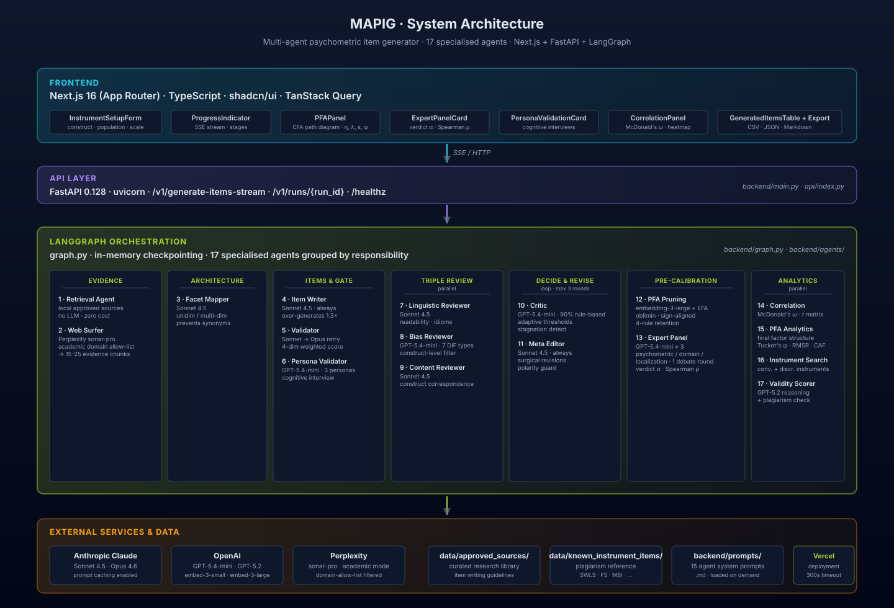

# MAPIG: Multi-Agent Psychometric Item Generator

**Generate psychometrically sound assessment items in minutes, not weeks — with a full audit trail you can trust.**

MAPIG is a research-grade web app that helps researchers, psychometricians, and clinicians draft survey items for new (or existing) psychological constructs. Type in what you want to measure, and a team of specialised AI agents will gather the academic evidence, map the construct's facet structure, draft Likert items, review them for clarity and bias, refine them through multiple rounds, and then estimate the scale's reliability and validity — all before you recruit a single respondent.

> **Important caveat**: MAPIG generates *candidate* items and *estimated* psychometric properties. It supports expert judgment but does **not** replace empirical piloting, factor analysis on respondent data, or formal validation studies. Use it as the first 80% of scale development, and your respondent data as the final 20%.


## Video tutorial

[](https://youtu.be/E7Hq1bwF5sk?si=FKhQORlNa61qjNcP)

A full walkthrough — how to define a construct, run the pipeline, read the results.

---

## Table of contents

1. [What MAPIG does](#what-mapig-does)
2. [Pipeline at a glance](#pipeline-at-a-glance)
3. [The agents — one by one](#the-agents--one-by-one)
4. [Pre-calibration analytics](#pre-calibration-analytics)
5. [LLM allocation & cost](#llm-allocation--cost)
6. [Observability & audit trail](#observability--audit-trail)
7. [Getting started](#getting-started)
8. [Testing (unit + Playwright E2E)](#testing-unit--playwright-e2e)
9. [Repository structure](#repository-structure)
10. [Deployment (Vercel)](#deployment-vercel)
11. [API reference](#api-reference)
12. [References](#references)

---

## What MAPIG does

You give MAPIG four things:

1. **A construct name** (e.g., `Workplace belonging`)
2. **A precise definition** (what it is, what it isn't)
3. **A target population** (e.g., `full-time employees in hybrid work`)
4. **A response scale** (e.g., `5-point Likert: Strongly disagree to Strongly agree`)

Then it runs a six-phase, end-to-end pipeline:

| Phase | What happens | Why it matters |
|---|---|---|
| **1. Evidence gathering** | Searches your local research library + Perplexity's academic search for theoretical grounding. | Items must be *evidence-anchored*, not invented. |
| **2. Construct mapping** | Identifies the construct's facets (sub-dimensions) before writing anything. | Prevents 10 items that are all synonyms of each other. |
| **3. Item drafting** | Generates Likert items, slightly over-generated so weak ones can be pruned. | Drafts that respect facets, evidence, and best practices. |
| **4. Validation + review** | Validates each item on 4 dimensions; three reviewers (linguistic / bias / content) run in parallel. | Quality gate with multiple independent angles. |
| **5. Critic & revise** | A critic decides accept-or-revise; a meta-editor surgically applies feedback. | Up to 3 revision rounds with adaptive thresholds. |
| **6. Pre-calibration analytics** | Persona check, PFA pruning, expert panel, factor analysis, instrument benchmarking, plagiarism. | Tells you what you have *before* recruiting respondents. |

The output: candidate items + a structural report (factor recovery, reliability, validity benchmarks, expert verdicts) + a complete audit trail.

---

## Pipeline at a glance



```
                    ┌─ Retrieval Agent (local sources)
Evidence gathering ─┤
                    └─ Web Surfer (Perplexity academic search)
                                │
                                ▼
                       Facet Mapper  ← decides facet structure
                                │
                                ▼
                       Item Writer  ← drafts ~1.3× requested items
                                │
                                ▼
                  ┌─ Validator (4-dim scoring, up to 3 attempts)
 Validation gate ─┤
                  └─ Persona Validator (cognitive interview, 3 personas)
                                │
                ┌───────────────┼───────────────┐
                ▼               ▼               ▼
       Linguistic      Bias            Content       (parallel)
        Reviewer    Reviewer         Reviewer
                └───────────────┼───────────────┘
                                ▼
                            Critic ── revise ──▶ Meta Editor ──┐
                                │       (loop, max 3 rounds)   │
                              accept                          ◀┘
                                │
                                ▼
                       PFA Pruning  ← drops weak items via factor analysis
                                │
                                ▼
                      Expert Panel  ← psychometric / domain / localization
                       (3 experts + 1 debate round + IRR)
                                │
                                ▼
                  Meta Editor (one final pass)
                                │
                                ▼
                          Finalize
                                │
            ┌───────────────────┼───────────────────┐
            ▼                   ▼                   ▼
     Correlation +      Instrument          Cross-construct
       PFA Analytics     Comparison +         Discriminant
     (parallel)        Validity + Plagiarism  Validity
                                │
                                ▼
                       Final Output (with full audit)
```

**Total typical runtime**: 60–250 seconds depending on iteration count and Perplexity latency.

---

## The agents — one by one

MAPIG has **17 specialised agents** divided into 6 functional groups. Each does one job well; they coordinate through LangGraph state.

### Group 1: Evidence gathering (the librarians)

#### 1. Retrieval Agent — `backend/agents/retrieval_agent.py`

- **Job**: Searches your **local research library** in `data/approved_sources/` for theoretical grounding.
- **Why**: Researchers often have curated PDFs, papers, scale manuals, or field notes they want the system to cite. The retrieval agent makes those first-class evidence sources.
- **How**: Pure deterministic text matching against the indexed library — no LLM, no API, no cost.
- **Output**: Evidence chunks tagged with source IDs.

#### 2. Web Surfer — `backend/agents/web_surfer.py`

- **Job**: Searches **Perplexity's academic mode** for peer-reviewed evidence (seminal papers, measurement precedents, definitions, boundary conditions).
- **Why**: Real scale development requires citing real literature. Perplexity is restricted to a configurable allowlist of academic domains (doi.org, psycnet.apa.org, Springer, Wiley, SAGE, Cambridge, etc.).
- **How**: Calls `sonar-pro` model with structured output requesting evidence chunks. If a `cultural_group` is set, runs an additional culturally-relevant search. Retries automatically with broader queries if too few sources are found.
- **Output**: 15–25 typed evidence chunks (theoretical_definition, dimensions, measurement_precedent, boundary_conditions, cultural_context).

---

### Group 2: Construct architecture

#### 3. Facet Mapper — `backend/agents/facet_mapper.py`

- **Job**: The **theoretical architect**. Identifies the construct's facet structure (sub-dimensions) *before* any items are written.
- **Why**: Without this step, LLMs default to writing 10 paraphrases of the same idea. By forcing the model to pick distinct facets first, items end up structurally diverse.
- **How**:
  - **Unidimensional mode** (default): treats the construct as one factor with a strict "negative space fence" (what the construct is NOT). If the literature reveals sub-constructs, they're surfaced as **separate run suggestions**, not split inline.
  - **Multi-dimensional mode** (user toggle): distributes items across identified facets.
- **Model**: Claude Sonnet 4.5.
- **Output**: A `FacetMapperResponse` listing each facet, its description, exclusions, and item allocation.

---

### Group 3: Item creation & quality gate

#### 4. Item Writer — `backend/agents/item_writer.py`

- **Job**: The **creative engine**. Writes the actual Likert items.
- **Why**: This is where psychometric craft matters — items must be unidimensional, positively keyed, free of double-barreled phrasing, and grounded in evidence.
- **How**: Receives the construct definition, target population, constraints, facet map, and evidence chunks. Each item gets a written rationale tying it to specific evidence sources.
- **Special behavior — over-generation**: Generates ~1.3× the requested items (capped at +5 extras, disabled when ≥12 items requested) so the downstream PFA Pruning stage can remove weak items. Prevents 10 items from devolving into synonyms.
- **Definition is authoritative**: If the construct name and definition disagree, items are written for the **definition**. Prior knowledge of the name's typical meaning is not used.
- **Model**: Claude Sonnet 4.5 (always — quality-critical).
- **Output**: `DraftItem` objects with `item_text`, `rationale`, `evidence_citations`, `facet_name`, `polarity` (`+` / `-`).

#### 5. Validator — `backend/agents/validator.py`

- **Job**: The **quality gate**. Scores every item on 4 weighted dimensions.
- **Why**: Items must clearly measure the construct, distinguish it from neighbors, be readable, and be specific. Anything below 7.0/10 (weighted) gets regenerated.
- **Dimensions and weights**:
    - **Correspondence** (50%): Does it match the construct definition?
    - **Distinctiveness** (25%): Is it clearly *this* construct, not a neighbor?
    - **Clarity** (15%): Unambiguous, concise, comprehensible?
    - **Specificity** (10%): Concrete language, no vague quantifiers?
- **Smart escalation**: Sonnet first (fast & cheap), Opus on retry attempts (more accurate). The escalation is logged as `VALIDATOR_MODEL_ESCALATION`.
- **Identical-score detection**: If the LLM gives every item the same dimension scores (laziness), it's forced to retry with a different model.
- **Per-failure logging**: Every failed item emits a `VALIDATOR_FAIL_DETAIL` log with each dimension score, so debugging is grep-friendly.
- **Output**: `ItemValidation` per item with dimension scores, weighted score, accept/reject decision.

#### 6. Persona Validator — `backend/agents/persona_validator.py`

- **Job**: A **semi-cognitive interview**. Generates respondent personas and asks each to rate items in their voice.
- **Why**: Catches a different failure mode than bias or linguistic clarity — items that *different respondents read differently* (e.g., a city worker reads "successful" as career, a rural respondent reads it as family).
- **How**:
  1. Generates 3 personas covering the youngest end, oldest end, and a culturally distinct sub-group of the target population.
  2. Each persona rates every item 1–5 + provides a 2–4 sentence cognitive-interview-style reasoning (what they thought it asked, alternatives considered, personal reason for their rating, anything jarring in the wording).
  3. Items where personas disagree by ≥ 2 Likert points are flagged for ambiguity.
- **Robustness**: Persona descriptors are length-capped (defensive truncation at 1500 chars) so the LLM can't crash the validator with overlong biographies.
- **Model**: GPT-5.4-mini (cost-controlled).
- **Output**: `PersonaValidationResponse` with per-item ratings, interpretations, flagged items, interpretive variance.

---

### Group 4: The triple review (parallel reviewers)

Three independent reviewers run **at the same time**, each looking at a different angle.

#### 7. Linguistic Reviewer — `backend/agents/linguistic_reviewer.py`

- **Job**: Hunts **readability and language problems**.
- **What it catches**: Vague quantifiers ("often", "sometimes" without time anchors), absolute terms ("always", "never"), double-barreled items, ambiguous wording, cultural idioms that may not translate.
- **Polarity guard**: When the user has `"Positively keyed only"` in constraints, the reviewer's `suggested_edit` values are forbidden from introducing negation tokens (`not`, `n't`, `never`, `no`).
- **Model**: Claude Sonnet 4.5 (or GPT-4o with the ChatGPT-critics toggle).
- **Output**: Severity-rated comments (1–5) per item with suggested edits.

#### 8. Bias Reviewer — `backend/agents/bias_reviewer.py`

- **Job**: Checks **fairness across groups** — would this item function differently for different respondents?
- **What it catches** (7 DIF bias types):
  1. Construct bias (culture-bound meanings)
  2. Linguistic bias
  3. Cultural reference bias
  4. Socioeconomic bias (e.g., assumes a "private workspace at home")
  5. Context access bias
  6. Protected attribute bias
  7. Intersectional bias
- **Construct-level filter**: If 60%+ of items are flagged with similar (Jaccard ≥ 0.5) bias concerns, those concerns are recognized as *construct-level* (not actionable) and suppressed.
- **Model**: GPT-5.4-mini (20× cheaper than Sonnet, accuracy-acceptable for fairness signals).
- **Output**: Severity-rated comments per item.

#### 9. Content Reviewer — `backend/agents/content_reviewer.py`

- **Job**: Tests **construct alignment** — do these items actually measure what we said?
- **How**: Simulates 5 expert judges rating each item's match to the construct. Checks against common near-neighbor constructs (job satisfaction, engagement, commitment, psychological safety, social support, etc.). Tracks facet-coverage balance.
- **Model**: Claude Sonnet 4.5 (or GPT-4o with toggle).
- **Output**: Severity-rated comments per item with `c_mean` (correspondence mean) and `d_mean` (distinctiveness mean) numerics.

---

### Group 5: Decision-making & revision

#### 10. Critic — `backend/agents/critic.py`

- **Job**: The **decision-maker**. Reads all reviewer feedback, decides accept or revise.
- **How**:
  - **Adaptive thresholds**: Round 1 is "strict" (only minor issues OK); Round 2 is "thorough" (one medium concern allowed); Round 3 is "final" (relaxed safety net).
  - **Rule-based fast path**: ~90% of accept/reject decisions use 0 LLM tokens via deterministic rules. Borderline cases fall through to LLM.
  - **Stagnation detection**: Detects when revisions are paraphrasing the same issues (Jaccard word similarity ≥ 0.7 between iterations) and force-accepts to avoid infinite loops.
  - **Construct-level bias downgrade**: If reviewers' bias comments are nearly identical (Jaccard ≥ 0.6), they're downgraded to severity 1 because they're construct-level, not item-level.
- **Hard stop**: 3 iterations max.
- **Model**: GPT-5.4-mini (when LLM path fires).
- **Output**: `accept` | `revise` | `stop_max_iterations` + reason. Every decision is logged as `CRITIC_DECISION` with severity distribution and threshold context.

#### 11. Meta Editor — `backend/agents/meta_editor.py`

- **Job**: The **surgeon**. Applies reviewer feedback precisely without breaking what's working.
- **How**:
  - Smart comment filtering: only severity ≥ 3 comments reach the editor (40–60% token reduction).
  - Construct fidelity priority: rejects edits that would change the measured construct (e.g., "I am satisfied with my life" → "My community is satisfied" is REJECTED).
  - **Post-edit polarity check**: If `"Positively keyed only"` is in constraints and the LLM accidentally introduced a negation, the change is reverted.
  - **Two phases**: `iterative` (in the critic loop) and `expert_revision` (one-shot pass after the Expert Panel produces consensus revisions; does NOT re-trigger the critic).
- **Model**: Claude Sonnet 4.5 (always).
- **Output**: `RevisionPlan` (summary + list of edits) + revised items. Iteration history is snapshotted for the audit trail.

---

### Group 6: Pre-calibration structural analysis

#### 12. PFA Pruning — `backend/agents/pfa_pruning.py` + `backend/agents/pfa_estimator.py`

- **Job**: Runs **Pseudo-Factor Analysis** (Varrasi et al., 2026) on the over-generated item pool and prunes items that don't load cleanly.
- **Why**: Catches items that look fine to reviewers but actually cluster together too tightly (redundancy) or drift away from the factor (poor fit).
- **How**:
  1. Embed items via OpenAI `text-embedding-3-large` (signs flipped for any reverse-keyed items).
  2. Build cosine-similarity matrix; treat as a correlation matrix.
  3. Run EFA via the pure-Python `factor-analyzer` package with **oblimin** rotation.
  4. **Sign-align factor columns** so dominant loadings are positive (Mulaik 2010 / Lorenzo-Seva & ten Berge 2006 convention).
  5. Apply the **4-rule retention check** from Suárez-Álvarez et al. (2026):
     - Item loads on its parent facet
     - Loads higher on parent than any other factor
     - Loads higher on parent than the average of cross-loadings
     - Loads higher than the average of all other items on the parent factor
  6. Drop items failing the rules — but **never drop the last item of any facet** (preserves coverage).
- **Time-budget guard**: Stops pruning if remaining Vercel budget falls below 30s.
- **Output**: Pruned item set + `PFAResult` (loadings, congruence, fit verdict, identifiability).

#### 13. Expert Panel — `backend/agents/expert_panel.py`

- **Job**: Three "expert" agents evaluate **face / content validity** on the cleaned item set.
- **The experts**:
  - **Psychometric Expert** (`expert_psychometric.md`): scores face validity, parsimony, redundancy, response-set vulnerability, and scaling appropriateness. **Auto-loads scale-development rules** from `data/approved_sources/item_writing_guidelines.md` and `data/item_style_reference.md` and uses them as the authoritative rule book — drop more rule docs in those locations to extend its reference base. References Kline (2015), DeVellis & Thorpe (2016), AERA/APA/NCME *Standards*.
  - **Domain Expert** (`expert_domain.md`): construct fidelity, theoretical alignment, evidence anchoring (receives top 5 evidence chunks).
  - **Localization Expert** (`expert_localization.md`): cultural fit, idiom risk, reading level, inclusivity, translatability.
- **Process**:
  1. Round 1: 3 parallel evaluations (1–5 score per item + comment for low scores).
  2. Round 2 (debate): each expert sees peers' anonymized scores and may revise items where they disagreed by ≥ 2 points. Capped at 1 round.
  3. Inter-rater reliability is computed in a way that respects the fact that **the experts use different rubrics** (see "How to read IRR" below).
- **How to read the IRR metrics**:
  - The three experts are *designed to disagree* on absolute scores. The Psychometric Expert grades face validity; the Domain Expert grades construct fidelity; the Localization Expert grades cultural fit. An item can score 5/5 from one and 2/5 from another and *both be correct*. So we don't compute a single agreement number on raw scores — we compute three signals:
  - **Verdict-level Krippendorff's α** (the headline metric): nominal α on whether each expert's bottom-line outcome is `accept` / `revise` / `reject_set`. This asks "do they agree on what to *do* with the items?" High here = the panel reaches consensus on the action even when rubrics differ. **This is the metric used to trigger warnings.**
  - **Pairwise Spearman ρ**: rank correlation between expert pairs. Asks "do they agree on which items are the best vs. worst?" — robust to rubric scale differences.
  - **Per-item Krippendorff's α** + **Cohen's κ** (legacy/informational): kept for backward compatibility, but low values are *expected* with differing rubrics and no longer flagged as quality issues.
- **Graceful degradation**: If the Vercel budget is tight, the panel skips the debate round (< 15s remaining) or returns partial consensus from whatever round-1 evals completed (< 8s remaining) — never fails wholesale.
- **Models**: GPT-5.4-mini for all three experts (cost-controlled).
- **Output**: `ExpertConsensus` with per-expert evaluations, debate revisions, all four IRR metrics, dissent flags (items with cross-rubric SD ≥ 1.0), and a `RevisionPlan` for the Meta Editor's final pass. The UI displays each expert's full per-item ratings + comments in expandable sections; the markdown export includes everything.

---

### Group 7: Post-finalization analytics

After the items are locked, four analytics agents run **in parallel** to estimate scale-level psychometric properties.

#### 14. Correlation Estimator — `backend/agents/correlation_estimator.py`

- **Job**: Estimates **inter-item correlations** without empirical data.
- **How**: Embeds items via `text-embedding-3-small`, computes pairwise cosine similarity. Validated by Hommel & Arslan (2024): r = .71 vs. real items, r = .89 vs. real scales, r = .86 vs. reliability estimates.
- **Computes**: McDonald's omega total (via `analytics/omega_calculator.py`), mean inter-item correlation, internal-consistency flag (optimal range / too low / too high), pairwise redundancy flags.
- **Output**: `CorrelationMatrix` with pair-level cells, omega, guidance.

#### 15. PFA Analytics — `backend/analytics/pfa_analytics.py`

- **Job**: Reports the **post-prune factor structure** for the UI.
- **How**: Same pipeline as PFA Pruning but on the *final* item set. Computes Tucker's congruence vs. expected facet pattern, factor recovery rate, RMSR + CAF model-free fit indices, eigenvalues, DAAL factor labels.
- **UI display — a proper CFA path diagram, not just a heatmap**:
  - **Latent factors** drawn as ellipses on the left, labelled `η` (eta) with the factor name and Tucker's congruence shown as `φ` (phi).
  - **Item indicators** drawn as rectangles in the middle, labelled `x₁`, `x₂`, … `xₙ`.
  - **Loading paths** drawn as arrows from each factor to each item, labelled with `λ = 0.73` (etc.). Strong primary loadings (≥ 0.30) are thick green; cross-loadings are thin grey.
  - **Residual variance circles** drawn to the right of each item, labelled `ε₁`, `ε₂`, … with the item's uniqueness (1 − λ²) shown below.
  - Below the diagram, a **measurement equations** block prints every item's standardized form: `x₁ = 0.732 · η + ε₁ (Var(ε) ≈ 0.464)`. This is the textbook CFA representation researchers expect to see in publications.
- **Output**: `PFAResult` consumed by `PFAPanel.tsx` which renders the diagram, the equations, the fit-index summary cards, and the eigenvalue badges (Kaiser cutoff highlighted).

#### 16. Instrument Searcher — `backend/agents/instrument_searcher.py`

- **Job**: Finds **published instruments** to benchmark against.
- **How**: Queries Perplexity's academic search for two instruments:
  - **Convergent**: measures the same construct (e.g., SWLS for life satisfaction)
  - **Discriminant**: measures a related-but-distinct construct (e.g., Flourishing Scale)
- **Filters out commercial publishers** (Pearson, PAR, MHS, WPS, Hogrefe, Mind Garden, etc.) since their instruments can't be freely compared.
- **Hardcoded fallbacks**: 5 psychological domains (wellbeing, burnout, resilience, engagement, belonging) have known open-access instruments.
- **Output**: `ComparisonInstrument` objects with name, citation, items (when available), psychometric properties.

#### 17. Validity Scorer — `backend/agents/validity_scorer.py`

- **Job**: Estimates **convergent + discriminant validity** + runs **plagiarism detection**.
- **How**:
  - **Embedding-based** (preferred when published items available): cosine similarity of item-set centroids.
  - **LLM-as-judge fallback** (when only the construct name is known): GPT-5.2 with high reasoning, dual-direction averaging (forward + reverse scoring) to mitigate position bias.
  - **Plagiarism**: `analytics/similarity_calculator.py` uses sentence-transformers (`all-mpnet-base-v2`, threshold 0.85) to flag items semantically similar to known instrument items.
- **Convergent validity > 0.85** triggers a **derivative warning** (items may be too close to the comparison instrument).
- **Output**: `convergent_validity_score`, plagiarism flags, `ConstructPairAnalysis` for cross-construct discriminant validity.

---

### Infrastructure & utilities

These aren't "agents" in the LLM sense, but are critical to the system.

| Module | Job |
|---|---|
| `backend/agents/sanitizer.py` | **Prompt-injection defense** + **construct/definition coherence check** (cosine similarity between name and definition; flags if the user typed `Cognitive Flexibility` with a definition that describes Curiosity). |
| `backend/agents/llm_factory.py` | Model selection per agent: validator → Sonnet/Opus, item writer → Sonnet, bias reviewer / critic / persona / experts → GPT-5.4-mini, validity scorer → GPT-5.2 reasoning. |
| `backend/agents/llm_utils.py` | `invoke_structured_with_usage`: structured output + token tracking + cache metrics. Emits the `LLM_CALL` log line for every call (provider, model, agent, elapsed, tokens, schema, status). |
| `backend/agents/prompt_loader.py` | Loads `.md` prompt files from `backend/prompts/` with shared system-prompt prefix. |
| `backend/analytics/krippendorff.py` | Pure-NumPy implementations of Krippendorff's α (ordinal) + Cohen's κ (linear-weighted). Used by the Expert Panel. |
| `backend/analytics/omega_calculator.py` | McDonald's omega from a synthetic correlation matrix. |
| `backend/analytics/similarity_calculator.py` | Sentence-transformer-based plagiarism detection. |
| `backend/checkpoint_config.py` | LangGraph in-memory checkpointer with all custom Pydantic types pre-registered. |

---

## Pre-calibration analytics

Beyond the per-agent descriptions above, here's how the analytics tell the full picture of a scale's quality.

### Synthetic inter-item correlations (Hommel & Arslan, 2024)

Real scale validation needs respondent data. But before piloting, MAPIG estimates the inter-item correlation matrix from item embeddings alone:

- All items go through `text-embedding-3-small`
- Pairwise cosine similarity → correlation matrix
- McDonald's ω total + mean inter-item correlation calculated
- Flags: `optimal_range` (0.15–0.50), `too_low` (items don't cohere), `too_high` (redundant)
- Pairs with r > 0.75 are flagged as redundant for review

### Factor structure (Pseudo-Factor Analysis)

EFA on the embedding-based correlation matrix using `factor-analyzer`:

| Metric | What it tells you |
|---|---|
| **Tucker's congruence** (`φ`) | How well factors match the expected facet structure. > 0.85 fair, > 0.95 excellent (Lorenzo-Seva & ten Berge 2006). |
| **Factor recovery rate** | % of expected factors successfully recovered (≥ 50% of expected items load on the right factor at ≥ 0.30). |
| **RMSR** (Root Mean Square Residual) | Lower is better. < 0.05 = good fit. |
| **CAF** (Common-Part Accounted For) | Higher is better. > 0.70 = good. |
| **Identifiability** | `over_identified` (typical) / `identified` / `saturated` (when n_items ≤ n_factors + 2; fit indices uninformative). |

**UI rendering: a CFA path diagram in the textbook style.** The PFA Panel shows your factor structure exactly the way you'd draw it on a whiteboard for a methods paper:

- **`η`** (eta) ellipses for latent factors, labelled with the factor name + φ
- **`xᵢ`** rectangles for item indicators
- **`λ`** loading paths from η to each xᵢ (thick green for primary loadings ≥ 0.30; thin grey for cross-loadings)
- **`εᵢ`** residual circles to the right of each item, with uniqueness `1 − λ²` shown
- A **measurement equations** block underneath: one line per item in the form `x₁ = 0.73 · η + ε₁ (Var(ε) ≈ 0.47)`

This makes the structural model interpretable at a glance — both for psychometricians (who get the standardized solution they expect) and for non-specialists (who can read what each item is "doing" in the model).

The **factor sign indeterminacy** problem is handled automatically: after EFA converges, each factor column is reflected so that its dominant loading is positive (Mulaik 2010 / Lorenzo-Seva & ten Berge 2006 convention). This means loadings on `Wellbeing` items always come out positive when items measure wellbeing — no more confusing all-negative loadings just because `oblimin` picked the reflected solution.

### Convergent / discriminant / cross-construct validity

- **Convergent validity** (vs. an instrument measuring the same construct): higher is better, but > 0.85 is suspiciously derivative.
- **Discriminant validity** (vs. an instrument measuring a related-but-distinct construct): lower is better, > 0.85 is a concern.
- **Cross-construct analysis**: explicit reasoning about expected vs. estimated overlap.

### Plagiarism detection

Sentence-transformer-based check against known item texts in `data/known_instrument_items/`. Items > 0.85 similar to a published item are flagged.

---

## LLM allocation & cost

MAPIG is deliberately stingy with expensive models. Cheap models do the volume work; quality-critical agents always get Sonnet or better.

| Agent | Default model | With `use_chatgpt_critics` toggle | Why this model |
|---|---|---|---|
| Facet Mapper | Claude Sonnet 4.5 | Same | Construct decomposition needs reasoning. |
| Item Writer | Claude Sonnet 4.5 | Same (always Sonnet) | Quality-critical, never downgraded. |
| Validator | Sonnet 4.5 → Opus 4.6 (smart escalation) | GPT-4o on critic-toggle | Sonnet is fast & cheap; Opus catches what Sonnet misses on retry. |
| Linguistic Reviewer | Claude Sonnet 4.5 | GPT-4o | Nuanced language judgments. |
| Bias Reviewer | **GPT-5.4-mini** | GPT-4o | Fairness signals don't need a flagship model; 20× cheaper. |
| Content Reviewer | Claude Sonnet 4.5 | GPT-4o | Construct fidelity is reasoning-heavy. |
| Critic | **GPT-5.4-mini** | GPT-4o | 90% rule-based (zero tokens); LLM only for borderline. |
| Meta Editor | Claude Sonnet 4.5 | Same | Surgical editing demands precision. |
| Persona Validator | **GPT-5.4-mini** | Same | Multiple persona calls; cost-controlled. |
| Expert Panel (× 3) | **GPT-5.4-mini** | Same | 3 + 3 = up to 6 calls; cost-controlled. |
| Correlation Estimator | OpenAI embeddings (`text-embedding-3-small`) | Same | Embeddings, not chat. |
| PFA Estimator | OpenAI embeddings (`text-embedding-3-large`) | Same | Higher-quality embeddings for factor analysis. |
| Instrument Searcher | Perplexity `sonar-pro` (academic mode) | Same | Built for citations. |
| Validity Scorer | GPT-5.2 (high reasoning) | Same | Dual-direction LLM-as-judge benefits from strong reasoning. |

### Cost optimizations

- **Smart validation tier**: Sonnet on attempt 1, Opus only on retries (~80% savings on items that pass first try).
- **Rule-based critic**: ~90% of accept/revise decisions use 0 LLM tokens.
- **Prompt caching**: Claude system prompts are cached (50% input cost reduction on Anthropic).
- **Smart comment filtering**: Meta-editor only sees severity ≥ 3 comments (40–60% token reduction).
- **Abbreviated payloads**: Reviewers receive a stripped UserRequest (~60% smaller than full).
- **Selective regeneration**: Only failed items are regenerated, never the whole batch.
- **Capped over-generation**: Item writer adds ≤ 5 extras (default factor 1.3, hard cap), not 2× — keeps validation cost bounded.

**Typical run cost** (10 items, 1–2 revision rounds, expert panel + analytics): **$0.80–$1.50**.

---

## Observability & audit trail

Every step of the pipeline emits structured log lines that are grep-friendly in Vercel logs or your terminal:

| Log prefix | What it tells you |
|---|---|
| `STEP_START` / `STEP_END` | Every node's start and end with elapsed time. |
| `LLM_CALL agent=X provider=Y model=Z elapsed=Ts input_tokens=N output_tokens=M cache_read=K schema=S status=ok\|fallback\|fail` | Every LLM invocation. p50/p99 latency, cache hit rate, schema validation success/failure are all derivable. |
| `VALIDATOR_FAIL_DETAIL item_idx=N attempt=K weighted=X correspondence=… distinctiveness=… clarity=… specificity=… low_dims=[…]` | Per-failed-item diagnostics. |
| `VALIDATION_RETRY_TRIGGER attempt=K/3 failed_items=[…] failed_scores=[…] reason=below_threshold` | Why a regen cycle fired. |
| `VALIDATOR_MODEL_ESCALATION attempt=K from=Sonnet to=Opus reason=…` | Smart-validation tier transitions. |
| `CRITIC_DECISION iteration=K mode=strict\|thorough\|final path=rule_based\|llm decision=accept\|revise severities={…} reason=…` | Every critic decision with full context. |
| `STAGNATION_CHECK iteration=K jaccard=X threshold=0.7 fired=…` | Why the stagnation safety net did or didn't trip. |
| `RULE_BASED_FAST_PATH …` | Fired when the rule-based critic falls through to the LLM. |
| `PFA_EMBED` / `PFA_COSINE_MATRIX` / `PFA_EFA_SOLVER` / `PFA_LOADINGS_RAW` / `PFA_SIGN_ALIGNMENT` / `PFA_TUCKER` / `PFA_RETENTION` / `PFA_VERDICT` | Full PFA stage-by-stage trace. |
| `EXPERT_PANEL start n_items=N debate_enabled=… time_budget=…s` / `EXPERT_PANEL_DEGRADED` / `EXPERT_PANEL_PARTIAL` | Expert panel lifecycle and graceful-degradation events. |
| `PERSONA_VALIDATOR start` / `PERSONA_TRUNCATED` / `PERSONA_VALIDATOR_PARTIAL` | Persona stage diagnostics. |
| `COMPARISON_PHASE start/done` + sub-step timings (`COMPARISON_SEARCH_INSTRUMENTS`, `COMPARISON_CONVERGENT_VALIDITY`, `COMPARISON_PLAGIARISM_CHECK`) | Where time is spent in the analytics phase. |

### Audit metadata in `FinalOutput`

Every run produces:

- `audit.thread_id`, `audit.run_id`, `audit.timestamp_utc`
- `audit.iteration_count`, `audit.stop_reason`
- Per-model token counts: `opus_tokens_used`, `sonnet_tokens_used`, `openai_tokens_used`, etc.
- Per-model cost in USD: `opus_cost`, `sonnet_cost`, `openai_cost`, `chatgpt_cost`, `total_cost`
- Cache metrics: `cache_read_tokens`, `cache_savings_usd`
- Quality flags: `force_accepted_below_threshold`, `forced_scores`, `warnings` (e.g., construct/definition mismatch)
- `iteration_history`: snapshot of every reviewer's comments per iteration (preserved across the loop, not lost)

---

## Getting started

### 1. Install dependencies

```bash
# Backend (Python via Poetry — or pip + requirements.txt)
poetry install

# Frontend (Next.js)
npm install
```

### 2. Configure environment

Create `.env` in the repo root:

```env
# Mode
APP_MODE=claude                 # or "openai" or "mock"

# Model providers
CLAUDE_API_KEY=sk-ant-...
OPENAI_API_KEY=sk-...

# Web search
SEARCH_PROVIDER=perplexity      # or "local" or "hybrid"
PERPLEXITY_API_KEY=pplx-...
PERPLEXITY_DOMAIN_FILTER=doi.org,psycnet.apa.org,link.springer.com,sciencedirect.com,onlinelibrary.wiley.com,tandfonline.com,journals.sagepub.com,academic.oup.com,cambridge.org
```

### 3. Run locally

```bash
npm run dev      # runs Next.js (port 3000) + uvicorn backend (port 8000) together
```

The app is available at `http://localhost:3000`. API docs at `http://localhost:8000/docs`.

### 4. Mock mode (for development without API costs)

```bash
APP_MODE=mock SEARCH_PROVIDER=local npm run dev
```

The full pipeline runs end-to-end with deterministic stub responses — perfect for UI development or running the Playwright E2E.

---

## Testing (unit + Playwright E2E)

### Backend unit tests

```bash
pytest                    # full suite (~280 tests)
pytest -W error           # zero-warning gate (treat warnings as errors)
pytest tests/test_smoke.py -v   # end-to-end mock-mode pipeline test
```

### Frontend type-check + build

```bash
npm run type-check
npm run build
npm test                  # Vitest component tests
```

### Playwright end-to-end

```bash
# One-time: install Chromium binary
npm run e2e:install

# Terminal 1: start dev server in mock mode
APP_MODE=mock SEARCH_PROVIDER=local npm run dev

# Terminal 2: run the E2E
npm run e2e
```

The single E2E spec (`tests-e2e/full-generation.spec.ts`) submits the form, waits for the streamed pipeline to complete, and asserts the major panels render (PFA, Expert, Persona, Items). It skips gracefully if the dev server isn't reachable, so it's safe to add to CI.

---

## Repository structure

```
lmaig-langgraph/
├── api/
│   └── index.py                     # Vercel serverless entry → exports FastAPI `app`
├── backend/
│   ├── main.py                      # FastAPI: routes, SSE streaming, run registry
│   ├── graph.py                     # LangGraph workflow: nodes, routing, state
│   ├── schemas.py                   # All Pydantic models (UserRequest, FinalOutput, …)
│   ├── settings.py                  # Environment configuration + feature flags
│   ├── checkpoint_config.py         # LangGraph checkpointer with custom-type registration
│   ├── logging_utils.py             # `step()` context manager, structured logs
│   ├── agents/
│   │   ├── retrieval_agent.py       # Local source search (no LLM)
│   │   ├── web_surfer.py            # Perplexity academic search
│   │   ├── facet_mapper.py          # Construct facet decomposition
│   │   ├── item_writer.py           # Drafts items, over-generation
│   │   ├── validator.py             # 4-dim scoring + smart escalation
│   │   ├── persona_validator.py     # Cognitive-interview personas
│   │   ├── linguistic_reviewer.py
│   │   ├── bias_reviewer.py
│   │   ├── content_reviewer.py
│   │   ├── critic.py                # Adaptive thresholds + stagnation
│   │   ├── meta_editor.py           # Surgical revision + polarity guard
│   │   ├── pfa_pruning.py           # Iterative item pruning
│   │   ├── pfa_estimator.py         # PFA core: EFA + sign alignment + retention
│   │   ├── expert_panel.py          # Multi-expert face/content validity
│   │   ├── correlation_estimator.py # Embedding-based correlations
│   │   ├── instrument_searcher.py
│   │   ├── validity_scorer.py
│   │   ├── sanitizer.py             # Injection defense + coherence check
│   │   ├── llm_factory.py           # Model routing
│   │   ├── llm_utils.py             # Structured output + LLM_CALL logs
│   │   └── prompt_loader.py
│   ├── analytics/
│   │   ├── pfa_analytics.py         # Post-final PFA report wrapper
│   │   ├── omega_calculator.py      # McDonald's ω
│   │   ├── krippendorff.py          # IRR (α + κ) in pure NumPy
│   │   └── similarity_calculator.py # Plagiarism (sentence-transformers)
│   └── prompts/                     # Agent system prompts (.md)
├── src/                             # Next.js frontend (App Router)
│   ├── app/                         # Pages
│   ├── components/                  # React components (shadcn/ui)
│   │   ├── PFAPanel.tsx             # SEM-style measurement-model diagram
│   │   ├── ExpertPanelCard.tsx
│   │   ├── PersonaValidationCard.tsx
│   │   ├── CorrelationPanel.tsx     # Heatmap + omega
│   │   ├── ComparisonPanel.tsx
│   │   ├── GeneratedItemsTable.tsx
│   │   ├── QualityChecksPanel.tsx   # Force-accept banner + audit warnings
│   │   └── …
│   └── lib/
│       ├── types.ts                 # TypeScript mirror of backend schemas
│       ├── export.ts                # CSV / JSON / Markdown export
│       └── …
├── public/                          # Static assets (architecture diagram, screenshots)
├── data/
│   ├── approved_sources/            # Local research library
│   └── known_instrument_items/      # For plagiarism detection
├── tests/                           # Backend pytest (~280 tests)
├── tests-e2e/
│   └── full-generation.spec.ts      # Playwright E2E
├── playwright.config.ts
├── next.config.js
├── vercel.json
├── package.json
├── pyproject.toml
├── requirements.txt                 # Vercel-installed Python deps (mirror of pyproject)
└── README.md
```

---

## Deployment (Vercel)

MAPIG ships as a **single Vercel project** — Next.js at the repo root, FastAPI as serverless functions in `/api`. Same domain, no CORS configuration.

### Steps

1. Connect the repo to Vercel. Framework preset: **Next.js** (auto-detected).
2. Set environment variables in the Vercel dashboard:

   ```
   CLAUDE_API_KEY=sk-ant-...
   OPENAI_API_KEY=sk-...
   APP_MODE=claude
   SEARCH_PROVIDER=perplexity
   PERPLEXITY_API_KEY=pplx-...
   PERPLEXITY_DOMAIN_FILTER=doi.org,psycnet.apa.org,link.springer.com,sciencedirect.com,onlinelibrary.wiley.com,tandfonline.com,journals.sagepub.com,academic.oup.com,cambridge.org
   NEXT_PUBLIC_API_URL=https://your-project.vercel.app
   ```
3. Push to main → Vercel auto-deploys (PR previews work too).

### Operational notes

- **Vercel Pro plan recommended** (300s function timeout). On Hobby (10s), the pipeline will time out.
- **Typical run**: 60–250s depending on iteration count.
- **In-memory checkpointing**: sessions don't survive cold starts. If a session is lost, the frontend gracefully prompts to start over.
- **Cold-start install**: ~2s on cached wheels (Vercel caches Python packages between deploys). The runtime venv at `/tmp/_vc_deps` is rebuilt per cold start — that's standard Vercel Python behavior, not a bug.

---

## API reference

### Required input

| Field | Description |
|---|---|
| `construct_name` | Name of the construct (e.g., `Workplace Belonging`). |
| `construct_definition` | Operational definition. The system uses the **definition** as authoritative, not the name. |
| `target_population` | Who will respond. |
| `response_scale` | E.g., `5-point Likert: Strongly disagree to Strongly agree`. |

### Optional input

| Field | Default | Description |
|---|---|---|
| `item_count` | 10 | Number of items to generate (range 2–50). |
| `constraints` | `[]` | Additional rules. **Always combined with** the standard baseline (no double-barreled, no idioms, minimize reading level, positively keyed). |
| `construct_exclusions` | none | What this construct is NOT — neighboring constructs. |
| `cultural_group` | none | Triggers culturally-relevant evidence search + persona generation. |
| `language` | English | Target language. |
| `is_unidimensional` | true | One factor (default) vs. multi-dimensional. |
| `approved_domains` | `[]` | Per-request academic domain allowlist for Perplexity. |
| `exclude_sources` | `[]` | Domains to block. |
| `human_feedback` | none | Free text from a previous round. |
| `previous_items` | `[]` | Items from a previous round to refine. |
| `model_provider` | `claude` | `claude` or `openai`. |
| `use_chatgpt_critics` | false | Use GPT-4o for reviewer agents (cost comparison mode). |
| `use_gpt52_analytics` | false | Enable GPT-5.2 reasoning models for analytics. |

### Output structure

| Field | Description |
|---|---|
| `final_items[]` | Generated items with text, rationale, evidence citations, validation scores. |
| `audit` | Thread/run IDs, iteration count, stop reason, cost breakdown, model info, warnings. |
| `correlation_matrix` | Pairwise correlations + McDonald's ω + redundancy flags. |
| `pfa_result` | Factor structure: loadings, congruence, recovery, fit verdict. |
| `expert_consensus` | Per-expert verdicts, IRR (Krippendorff's α + Cohen's κ), dissent flags, consensus revisions. |
| `persona_validation` | Persona descriptors, ratings, cognitive-interview interpretations, ambiguity flags. |
| `comparison_instruments[]` | Convergent + discriminant published instruments. |
| `convergent_validity_score` | 0.0–1.0. |
| `cross_construct_analysis` | Discriminant validity + construct-pair reasoning. |
| `plagiarism_flags` | Items flagged for similarity to known instruments. |
| `linguistic_feedback` / `bias_feedback` / `content_feedback` | All reviewer comments preserved across iterations. |
| `iteration_history[]` | Per-iteration snapshot of all reviewer comments. |

### Endpoints

| Endpoint | Purpose |
|---|---|
| `POST /v1/generate-items-stream` | SSE-streamed generation with progress events. |
| `POST /v1/generate-items` | Non-streamed (returns full result on completion). |
| `GET /healthz` | Health check. |
| `GET /v1/runs/{run_id}` | Recover an in-progress run. |

---

## Contributing

Issues and PRs welcome for:
- Stability fixes
- Prompt and reviewer-quality improvements
- UX and accessibility upgrades
- New analytics agents (e.g., test–retest reliability simulation, DIF estimation)
- Performance and observability enhancements

## Maintainer

Created by **Prof. Llewellyn E. van Zyl, Ph.D.**

- Website: [psynalytics.com](https://www.psynalytics.com)
- Personal: [llewellynvanzyl.com](https://www.llewellynvanzyl.com)
- GitHub: [@llewellynvz](https://github.com/llewellynvz)

## License

Proprietary. Personal, academic, and internal research use is permitted. Redistribution and commercial use are not.

---

## References

**Embedding-based correlation estimation**
- Hommel, B. E., & Arslan, R. C. (2024). Language models accurately infer correlations between psychological items and scales from text alone. *European Journal of Psychological Assessment*. https://doi.org/10.1027/1015-5759/a000838

**Multi-agent psychometric AIG**
- Lee, P., Son, M., & Jia, Z. (2025). AI-powered automatic item generation for psychological tests: A conceptual framework for an LLM-based multi-agent AIG system. *Journal of Business and Psychology*, 1–29.

**Pseudo-Factor Analysis & AI test construction**
- Varrasi, S., Platania, G. A., Castellano, S., et al. (2026). Expanding psychometrics with pretrained language models: Evaluating pseudo-factor analysis in applied and multilingual contexts. *Methods in Psychology*, 14, 100244.
- Suárez-Álvarez, J., He, Q., Guenole, N., & D'Urso, D. (2026). Using artificial intelligence in test construction: A practical guide. *Psicothema*, 38(1), 1–12.

**Factor analysis foundations**
- Mulaik, S. A. (2010). *Foundations of Factor Analysis* (2nd ed.). CRC Press.
- Lorenzo-Seva, U., & ten Berge, J. M. F. (2006). Tucker's congruence coefficient as a meaningful index of factor similarity. *Methodology*, 2(2), 57–64.

**Inter-rater reliability**
- Krippendorff, K. (2018). *Content Analysis: An Introduction to Its Methodology* (4th ed.). Sage.

**Scale development textbooks**
- Kline, P. (2015). *A Handbook of Test Construction: Introduction to Psychometric Design*. Routledge.
- DeVellis, R. F., & Thorpe, C. T. (2021). Scale development: Theory and applications. Sage publications.
- AERA, APA, NCME. (2014). *Standards for Educational and Psychological Testing*.

**Methodology**
- Clark, L. A., & Watson, D. (1995). Constructing validity: Basic issues in objective scale development. *Psychological Assessment*, 7(3), 309–319.
